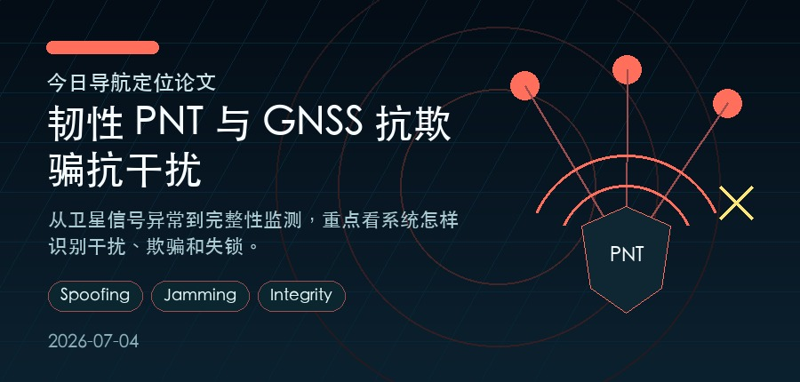

# 每日 GNSS 欺骗检测 / 多模态融合 / SLAM 论文推荐 | 2026-07-04

今天这期看 **韧性 PNT 与 GNSS 抗欺骗抗干扰**。

我挑了 5 篇最近值得看的论文，重点看 GNSS 异常、PNT 完整性和抗欺骗抗干扰。真正有用的工作不只报告检测率，还会说明误报从哪里来，以及定位系统怎样在告警后继续工作。

## 今日速览

1. **GNSS Jamming Detection with Automatic Gain Control (AGC) and Carrier-to-Noise Ratio Density (CNO) Observables from a COTS receiver**
   - 作者：Syed Ali Kazim, Anas Darwich, Juliette Marais
   - 日期：2026-02-13
   - 链接：http://arxiv.org/abs/2602.12688v1
   - 质量信号：质量分 0.0；venue 7th SmartRacon scientific seminar, Oct 2025, Stuttgart, Germany
   - 推荐理由：主题贴合 GNSS 欺骗与干扰检测，关键词集中在 gnss、gps、spoofing、jamming、interference、integrity、detection、receiver。质量信号：venue 7th SmartRacon scientific seminar, Oct 2025, Stuttgart, Germany，适合作为今日跟踪论文。
2. **LXD-SLAM: LiDAR+X Dense SLAM with $\sum_{i=0}^{5}C_5^i$ Configurable Sensor Combinations**
   - 作者：Zhong Wang, Lin Zhang, Linfei Li, Ying Shen 等
   - 日期：2026-06-26
   - 链接：http://arxiv.org/abs/2606.27811v1
   - 质量信号：质量分 8.0；代码开源；真实实验
   - 推荐理由：主题贴合 多模态/多传感器融合、SLAM 与鲁棒里程计，关键词集中在 fusion、multi-sensor、lidar、visual、camera、imu、gnss、kalman。质量信号：代码开源、强调真实实验，适合作为今日跟踪论文。
3. **Self-supervised Geometry Reasoning for LiDAR Simultaneous Localization and Mapping**
   - 作者：Jiwoo Kim, Jinwoo Lee, Woojae Shin, Giseop Kim 等
   - 日期：2026-06-29
   - 链接：http://arxiv.org/abs/2606.30166v1
   - 质量信号：质量分 0.0；暂无外部质量元数据
   - 推荐理由：主题贴合 SLAM 与鲁棒里程计，关键词集中在 slam、odometry、localization、mapping、loop、gaussian。质量信号以主题相关和新近度为主，适合作为今日跟踪论文。
4. **AUSLUN: A Fixed-Hover UAV--USV System for GNSS-Denied Maritime Search and Navigation**
   - 作者：Siyuan Yang, Zikai Jia, Hailiang Kuang, Xiaoyu He 等
   - 日期：2026-06-29
   - 链接：http://arxiv.org/abs/2606.29875v1
   - 质量信号：质量分 14.0；venue NAVIGATION；代码开源；真实实验
   - 推荐理由：主题贴合 多模态/多传感器融合、SLAM 与鲁棒里程计，关键词集中在 visual、inertial、gnss、odometry、localization、loop、vio。质量信号：venue NAVIGATION、代码开源、强调真实实验，适合作为今日跟踪论文。
5. **DL-VINS-Factory: A Modular Framework for Learned Visual Front-Ends in Visual-Inertial SLAM**
   - 作者：Shoon Kit Lim, Melissa Jia Ying Chong, Ting Yang Ling
   - 日期：2026-07-02
   - 链接：http://arxiv.org/abs/2607.01757v1
   - 质量信号：质量分 8.5；代码开源；数据集/benchmark
   - 推荐理由：主题贴合 多模态/多传感器融合、SLAM 与鲁棒里程计，关键词集中在 visual、camera、inertial、tightly coupled、slam、odometry、loop。质量信号：代码开源、有数据集/benchmark 线索，适合作为今日跟踪论文。

## 重点推荐

### 1. GNSS Jamming Detection with Automatic Gain Control (AGC) and Carrier-to-Noise Ratio Density (CNO) Observables from a COTS receiver

- **论文信息**：Syed Ali Kazim, Anas Darwich, Juliette Marais；2026-02-13；eess.SP
- **原文链接**：http://arxiv.org/abs/2602.12688v1
- **关键词**：gnss、gps、spoofing、jamming、interference、integrity、detection、receiver
- **质量信号**：质量分 0.0；venue 7th SmartRacon scientific seminar, Oct 2025, Stuttgart, Germany
- **为什么值得读**：这篇论文同时覆盖 GNSS 欺骗与干扰检测，并在标题/摘要中出现 gnss、gps、spoofing、jamming、interference、integrity、detection、receiver 等信号；质量侧还有 质量分 0.0；venue 7th SmartRacon scientific seminar, Oct 2025, Stuttgart, Germany。它适合用来观察该方向近期如何处理鲁棒性、异常检测或融合估计问题。
- **对 GNSS/融合/SLAM 系统的启发**：可借鉴其异常定义和误报抑制思路，把 GNSS 可信度作为状态估计输入的一部分，而不是孤立阈值。
- **摘要要点**：从题名与摘要看，论文主要关注 GNSS 欺骗/干扰场景下的异常识别与完整性监测；技术线索包括 gnss、gps、spoofing、jamming、interference、integrity。阅读全文时建议重点看 可观测量设计、误报控制、攻击与非攻击故障的区分方式，再判断是否适合迁移到自己的工程链路。

### 2. LXD-SLAM: LiDAR+X Dense SLAM with $\sum_{i=0}^{5}C_5^i$ Configurable Sensor Combinations

- **论文信息**：Zhong Wang, Lin Zhang, Linfei Li, Ying Shen 等；2026-06-26；cs.RO
- **原文链接**：http://arxiv.org/abs/2606.27811v1
- **关键词**：fusion、multi-sensor、lidar、visual、camera、imu、gnss、kalman、slam、odometry
- **质量信号**：质量分 8.0；代码开源；真实实验
- **为什么值得读**：这篇论文同时覆盖 多模态/多传感器融合、SLAM 与鲁棒里程计，并在标题/摘要中出现 fusion、multi-sensor、lidar、visual、camera、imu、gnss、kalman、slam、odometry 等信号；质量侧还有 质量分 8.0；代码开源；真实实验。它适合用来观察该方向近期如何处理鲁棒性、异常检测或融合估计问题。
- **对 GNSS/融合/SLAM 系统的启发**：适合关注传感器时空同步、退化场景切换和外点剔除策略，这些通常决定系统能否从实验室走向实车/无人机部署。
- **摘要要点**：从题名与摘要看，论文主要关注 多传感器融合定位中的一致性、同步和退化处理；技术线索包括 fusion、multi-sensor、lidar、visual、camera、imu。阅读全文时建议重点看 融合框架、传感器缺失时的降级策略、外点剔除和实时性，再判断是否适合迁移到自己的工程链路。

### 3. Self-supervised Geometry Reasoning for LiDAR Simultaneous Localization and Mapping

- **论文信息**：Jiwoo Kim, Jinwoo Lee, Woojae Shin, Giseop Kim 等；2026-06-29；cs.RO
- **原文链接**：http://arxiv.org/abs/2606.30166v1
- **关键词**：slam、odometry、localization、mapping、loop、gaussian
- **质量信号**：质量分 0.0；暂无外部质量元数据
- **为什么值得读**：这篇论文同时覆盖 SLAM 与鲁棒里程计，并在标题/摘要中出现 slam、odometry、localization、mapping、loop、gaussian 等信号；质量侧还有 质量分 0.0；暂无外部质量元数据。它适合用来观察该方向近期如何处理鲁棒性、异常检测或融合估计问题。
- **对 GNSS/融合/SLAM 系统的启发**：可以从前端观测选择、后端约束建模和回环恢复三个角度拆解，判断它是否适合迁移到自己的 SLAM 栈。
- **摘要要点**：从题名与摘要看，论文主要关注 SLAM/里程计在复杂环境中的鲁棒状态估计；技术线索包括 slam、odometry、localization、mapping、loop、gaussian。阅读全文时建议重点看 前端几何建模、后端约束、回环或地图表达对鲁棒性的贡献，再判断是否适合迁移到自己的工程链路。

### 4. AUSLUN: A Fixed-Hover UAV--USV System for GNSS-Denied Maritime Search and Navigation

- **论文信息**：Siyuan Yang, Zikai Jia, Hailiang Kuang, Xiaoyu He 等；2026-06-29；cs.RO
- **原文链接**：http://arxiv.org/abs/2606.29875v1
- **关键词**：visual、inertial、gnss、odometry、localization、loop、vio
- **质量信号**：质量分 14.0；venue NAVIGATION；代码开源；真实实验
- **为什么值得读**：这篇论文同时覆盖 多模态/多传感器融合、SLAM 与鲁棒里程计，并在标题/摘要中出现 visual、inertial、gnss、odometry、localization、loop、vio 等信号；质量侧还有 质量分 14.0；venue NAVIGATION；代码开源；真实实验。它适合用来观察该方向近期如何处理鲁棒性、异常检测或融合估计问题。
- **对 GNSS/融合/SLAM 系统的启发**：适合关注传感器时空同步、退化场景切换和外点剔除策略，这些通常决定系统能否从实验室走向实车/无人机部署。
- **摘要要点**：从题名与摘要看，论文主要关注 SLAM/里程计在复杂环境中的鲁棒状态估计；技术线索包括 visual、inertial、gnss、odometry、localization、loop。阅读全文时建议重点看 前端几何建模、后端约束、回环或地图表达对鲁棒性的贡献，再判断是否适合迁移到自己的工程链路。

### 5. DL-VINS-Factory: A Modular Framework for Learned Visual Front-Ends in Visual-Inertial SLAM

- **论文信息**：Shoon Kit Lim, Melissa Jia Ying Chong, Ting Yang Ling；2026-07-02；cs.CV
- **原文链接**：http://arxiv.org/abs/2607.01757v1
- **关键词**：visual、camera、inertial、tightly coupled、slam、odometry、loop
- **质量信号**：质量分 8.5；代码开源；数据集/benchmark
- **为什么值得读**：这篇论文同时覆盖 多模态/多传感器融合、SLAM 与鲁棒里程计，并在标题/摘要中出现 visual、camera、inertial、tightly coupled、slam、odometry、loop 等信号；质量侧还有 质量分 8.5；代码开源；数据集/benchmark。它适合用来观察该方向近期如何处理鲁棒性、异常检测或融合估计问题。
- **对 GNSS/融合/SLAM 系统的启发**：适合关注传感器时空同步、退化场景切换和外点剔除策略，这些通常决定系统能否从实验室走向实车/无人机部署。
- **摘要要点**：从题名与摘要看，论文主要关注 SLAM/里程计在复杂环境中的鲁棒状态估计；技术线索包括 visual、camera、inertial、tightly coupled、slam、odometry。阅读全文时建议重点看 前端几何建模、后端约束、回环或地图表达对鲁棒性的贡献，再判断是否适合迁移到自己的工程链路。

## 今日观察

PNT 韧性正在从单一 GNSS 接收机指标，走向多源一致性判断。对机器人和无人系统来说，更可靠的做法是把欺骗、干扰、遮挡和传感器退化一起放进状态估计链路里处理。

## 明日检索关键词

`resilient PNT`、`GNSS spoofing detection`、`GNSS jamming detection`、`PNT integrity`、`OSNMA`、`GNSS denied localization`。

> 具体实验结论建议回到原文核对后再引用。
