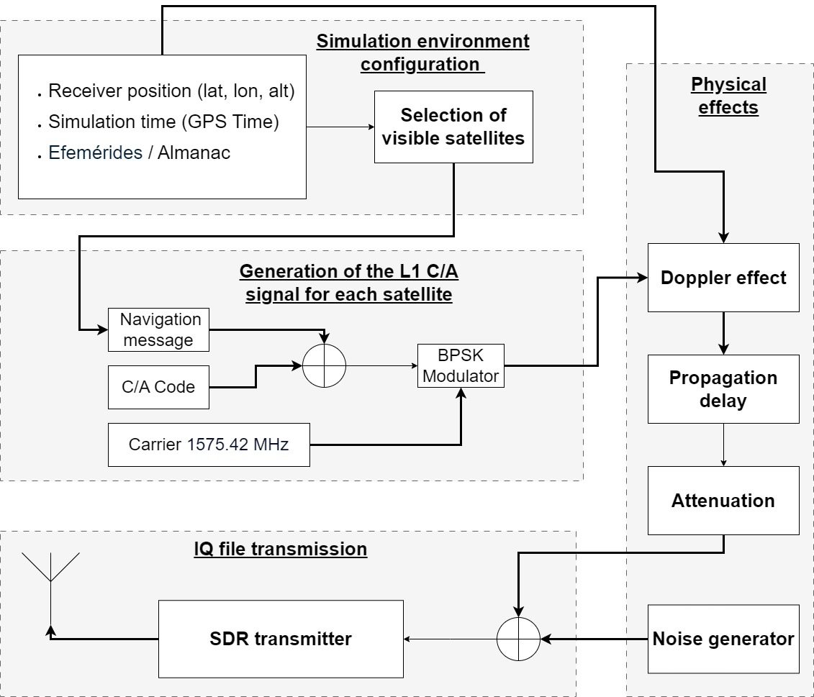

# 论文解读｜GNSS Spoofing Threat for V2X communications

- 作者：波波机器人
- 论文作者：Adolfo P. Jimenez, Juan Arquero-Gallego, Mario P. Luna, Jose E. Naranjo 等
- 日期：2026-06-18
- 原文：http://arxiv.org/abs/2606.20215v1

## 一句话读懂

这篇论文围绕GNSS/PNT 接收机以及依赖它的车辆、机器人或授时系统遇到的“外部信号可能被伪造、压制或缓慢拉偏，系统却还会输出看似可信的位置或时间”展开，核心看点是作者把做法落在接收机观测、攻击构造、检测统计量、保护级或轻量模型，也就是先把可观测变量和处理链路说清楚；文本线索：In this way, carefully controlled positioning errors are introduced without causing an abrupt loss of signal, making the attack d...。

## 读前抓手

- 先圈题目里的关键词：PNT, GNSS, GPS, spoofing, IMU, VIO, SDR, V2X。它们把文章带到开放环境里的定位、导航和授时链路，后文要追的是外部信号可能被伪造、压制或缓慢拉偏，系统却还会输出看似可信的位置或时间。
- 摘要给出的第一条线索是：作者先把矛盾压到外部信号可能被伪造、压制或缓慢拉偏，系统却还会输出看似可信的位置或时间这一点上；文本线索：Global navigation satellite systems have become a fundamental infrastructure of modern society, forming the backbone of positioni...。这决定了文章不是只看最终效果，而是在追踪问题怎样发生。
- 第二条线索落在做法：作者把做法落在接收机观测、攻击构造、检测统计量、保护级或轻量模型，也就是先把可观测变量和处理链路说清楚；文本线索：In this way, carefully controlled positioning errors are introduced without causing an abrupt loss of signal, making the attack d...。读方法时优先找输入、假设、核心运算和输出。
- 图注里反复出现 GNSS, GPS, IMU, V2X, spoofing，说明主图很可能承载了系统流程、实验设置或结果对比。

## 故事版导读

读《GNSS Spoofing Threat for V2X communications》时，可以先把主角放在开放环境里的定位、导航和授时链路里：作者先把矛盾压到外部信号可能被伪造、压制或缓慢拉偏，系统却还会输出看似可信的位置或时间这一点上；文本线索：Global navigation satellite systems have become a fundamental infrastructure of modern society, forming the backbone of positioni...。作者接着把镜头推到做法上，重点是作者把做法落在接收机观测、攻击构造、检测统计量、保护级或轻量模型，也就是先把可观测变量和处理链路说清楚；文本线索：In this way, carefully controlled positioning errors are introduced without causing an abrupt loss of signal, making the attack d...。到了实验部分，证据会落在作者用真实设备、回放信号、公开攻击数据、误报漏报、时间误差或部署算力来检验方案，而不是只停在概念解释；文本线索：The experimental assessment is performed on a controlled testbench that integrates commercial vehicular communication devices wit...。最后再回到工程问题：文章最后要回答这件事能否服务于GNSS 可信度评估、融合定位降权、告警策略和完整性监测；文本线索：Both analytical modeling and experimental evaluation demonstrate that GNSS-based synchronization mechanisms used in V2X sys- tems...。这样读下来，论文就不是一堆模块名，而是一条从风险、动作、证据到落地边界的线。

## 章节精读

### 1. 背景和问题：先看矛盾从哪来

这一节先给问题定边界：主角是GNSS/PNT 接收机以及依赖它的车辆、机器人或授时系统，压力来自外部信号可能被伪造、压制或缓慢拉偏，系统却还会输出看似可信的位置或时间。作者先把矛盾压到外部信号可能被伪造、压制或缓慢拉偏，系统却还会输出看似可信的位置或时间这一点上；文本线索：Global navigation satellite systems have become a fundamental infrastructure of modern society, forming the backbone of positioni...。读到这里要抓住两个变量：系统相信了什么输入，以及这个输入在什么条件下会失真。

- 场景压力：作者先把矛盾压到外部信号可能被伪造、压制或缓慢拉偏，系统却还会输出看似可信的位置或时间这一点上；文本线索：Global navigation satellite systems have become a fundamental infrastructure of modern society, forming the backbone of positioni...。
- 失效来源：作者先把矛盾压到外部信号可能被伪造、压制或缓慢拉偏，系统却还会输出看似可信的位置或时间这一点上；文本线索：It is estimated that any significant disruption to GNSS services could cause substantial economic losses due to their widespread...。
- 作者抓住的变量：作者先把矛盾压到外部信号可能被伪造、压制或缓慢拉偏，系统却还会输出看似可信的位置或时间这一点上；文本线索：This strong dependence on GNSS-based positioning, naviga- tion, and timing capabilities makes many sectors of the economy particu...。
- 这对定位系统的影响：作者先把矛盾压到外部信号可能被伪造、压制或缓慢拉偏，系统却还会输出看似可信的位置或时间这一点上；文本线索：TEC-2024/ECO-277) and Strengthening C-ITS Adoption and Lining-up across Europe (SCALE) funded by CEF-T-2023-SIMOBGEN – 101172496.。

### 2. 方法拆解：把做法拆成输入、核心动作和输出

方法部分可以拆成三步：先确认输入数据，再看作者怎样构造接收机观测、攻击构造、检测统计量、保护级或轻量模型，最后看输出如何服务于GNSS 可信度评估、融合定位降权、告警策略和完整性监测。作者把做法落在接收机观测、攻击构造、检测统计量、保护级或轻量模型，也就是先把可观测变量和处理链路说清楚；文本线索：In this way, carefully controlled positioning errors are introduced without causing an abrupt loss of signal, making the attack d...。这一步要把每个模块和它消耗的观测量对上号。

- 输入/观测：作者把做法落在接收机观测、攻击构造、检测统计量、保护级或轻量模型，也就是先把可观测变量和处理链路说清楚；文本线索：4.1 Controlled Testbench for GNSS Spoofing Evaluation To assess the effects of GNSS spoofing on vehicular navigation systems, a c...。
- 核心步骤：作者把做法落在接收机观测、攻击构造、检测统计量、保护级或轻量模型，也就是先把可观测变量和处理链路说清楚；文本线索：Within the CAPEC (Common Attack Pattern Enumeration and Classification) frame- work [30], a carry-off GNSS spoofing attack is cla...。
- 模型或检测量：作者把做法落在接收机观测、攻击构造、检测统计量、保护级或轻量模型，也就是先把可观测变量和处理链路说清楚；文本线索：This study focuses on a carry-off GNSS spoofing attack, where counterfeit signals are first synchronized with legitimate GNSS sig...。
- 输出形式：作者把做法落在接收机观测、攻击构造、检测统计量、保护级或轻量模型，也就是先把可观测变量和处理链路说清楚；文本线索：In this way, carefully controlled positioning errors are introduced without causing an abrupt loss of signal, making the attack d...。
- 接入方式：作者把做法落在接收机观测、攻击构造、检测统计量、保护级或轻量模型，也就是先把可观测变量和处理链路说清楚；文本线索：Under nominal conditions, the OBU determines its position based on genuine satellite transmissions.。

### 3. 主图和关键图解：先沿着数据流走一遍

主图：Functional block diagram of the GPS L1 C/A signal simulation and transmis-

这张图围绕信号或时间轴展开。读图时把异常输入、接收机状态和最终告警连起来，看作者是否把外部信号可能被伪造、压制或缓慢拉偏，系统却还会输出看似可信的位置或时间从现象拆成了可测量的变量。图注里的关键词是 GPS, IMU。

论文图：SNR vs

这张图放在后面看细节：它要么补充实验对比，要么解释某个模块的内部变量。读的时候把它和真实设备、回放信号、公开攻击数据、误报漏报、时间误差或部署算力对应起来。

### 4. 实验验证：看数据、场景和指标是否对得上问题

实验部分要回答“证据够不够”。这篇的证据应落在真实设备、回放信号、公开攻击数据、误报漏报、时间误差或部署算力。作者用真实设备、回放信号、公开攻击数据、误报漏报、时间误差或部署算力来检验方案，而不是只停在概念解释；文本线索：The experimental assessment is performed on a controlled testbench that integrates commercial vehicular communication devices wit...。读表格和曲线时，把数据来源、对比对象、失败场景和指标单位放在一起看。

- 数据来源：作者用真实设备、回放信号、公开攻击数据、误报漏报、时间误差或部署算力来检验方案，而不是只停在概念解释；文本线索：is defined in which a test vehicle equipped with an OBU drives along a road while receiving GNSS signals.。
- 实验场景：作者用真实设备、回放信号、公开攻击数据、误报漏报、时间误差或部署算力来检验方案，而不是只停在概念解释；文本线索：Within the CAPEC (Common Attack Pattern Enumeration and Classification) frame- work [30], a carry-off GNSS spoofing attack is cla...。
- 对比指标：作者用真实设备、回放信号、公开攻击数据、误报漏报、时间误差或部署算力来检验方案，而不是只停在概念解释；文本线索：7 Figure 3: Evaluation testbench for GNSS spoofing attacks in V2X networks.。
- 结果读法：作者用真实设备、回放信号、公开攻击数据、误报漏报、时间误差或部署算力来检验方案，而不是只停在概念解释；文本线索：This study focuses on a carry-off GNSS spoofing attack, where counterfeit signals are first synchronized with legitimate GNSS sig...。
- 失败边界：作者用真实设备、回放信号、公开攻击数据、误报漏报、时间误差或部署算力来检验方案，而不是只停在概念解释；文本线索：In this way, carefully controlled positioning errors are introduced without causing an abrupt loss of signal, making the attack d...。

### 5. 贡献边界和复现：把亮点翻成工程判断

收束部分要看作者把贡献限定在哪里。对工程读者来说，关键不是记住一个新名字，而是判断它能否接到GNSS 可信度评估、融合定位降权、告警策略和完整性监测。文章最后要回答这件事能否服务于GNSS 可信度评估、融合定位降权、告警策略和完整性监测；文本线索：Both analytical modeling and experimental evaluation demonstrate that GNSS-based synchronization mechanisms used in V2X sys- tems...。

- 主要贡献：文章最后要回答这件事能否服务于GNSS 可信度评估、融合定位降权、告警策略和完整性监测；文本线索：Both analytical modeling and experimental evaluation demonstrate that GNSS-based synchronization mechanisms used in V2X sys- tems...。
- 适用条件：文章最后要回答这件事能否服务于GNSS 可信度评估、融合定位降权、告警策略和完整性监测；文本线索：and Future Work The results confirm that spoofing attacks against V2X infrastructure are physically fea- sible under realistic op...。
- 工程收益：文章最后要回答这件事能否服务于GNSS 可信度评估、融合定位降权、告警策略和完整性监测；文本线索：It also demonstrates that these attacks can be carried out without being detected by the system, posing a real cybersecurity thre...。
- 需要复核的边界：文章最后要回答这件事能否服务于GNSS 可信度评估、融合定位降权、告警策略和完整性监测；文本线索：As illustrated by the results obtained, these attacks are feasible under different test conditions, demonstrating that the V2X co...。

## 读完之后可以追问

- 如果把 PNT 换到自己的机器人或车辆平台，最先需要重新标定的是输入数据、阈值，还是传感器外参？
- 论文里的证据是否覆盖了开放环境里的定位、导航和授时链路里最容易失败的场景，还是只证明了一个受控设置？
- 这套做法接入GNSS 可信度评估、融合定位降权、告警策略和完整性监测时，应该输出连续可信度、离散告警，还是直接改变优化权重？

> 图像来自论文 PDF，仅用于论文解读和学术讨论，正式转载前建议核对论文许可和作者要求。
