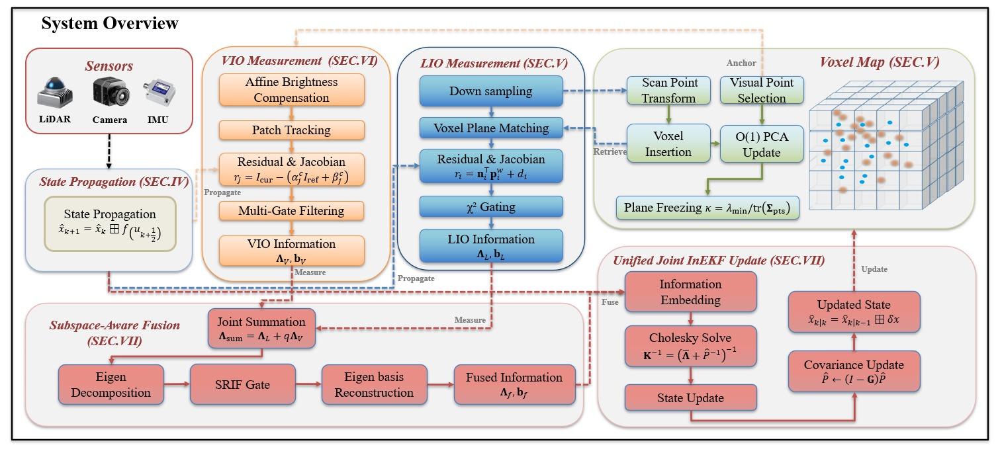
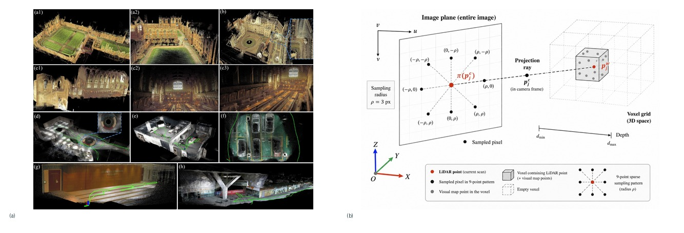

# 论文解读｜SA-LIVO: Efficient LiDAR-Inertial-Visual Odometry with Subspace-Aware Degeneracy Handling

- 作者：波波机器人
- 论文作者：Yinong Cao, Xin He, Yuwei Chen, Shijie Liu 等
- 日期：2026-06-24
- 原文：http://arxiv.org/abs/2606.25699v1

## 阅读原文

- [原文页面](http://arxiv.org/abs/2606.25699v1)
- [PDF下载](https://arxiv.org/pdf/2606.25699v1)

## 一句话读懂

这篇论文聚焦移动机器人定位与建图系统面临的核心挑战：单一传感器在遮挡、稀疏几何、动态物体或长距离运行中可能失去稳定约束。其核心亮点在于，方法主线围绕传感器融合、几何约束、地图表达、回环检测或学习式前端，将系统输入、处理与输出有机地串联起来。重点关注词汇包括 LiDAR, odometry, fusion, visual, SA-LIVO。

## 读前抓手

- 题目里最值得先圈出的词是：odometry, lidar-inertial, visual-inertial, livo, fusion, degeneracy, degradation, LiDAR。它们把文章带到室内外移动机器人、自动驾驶或大尺度建图场景，也暗示后面要解决单一传感器会在遮挡、稀疏几何、动态物体或长距离运行中失去稳定约束。
- 摘要先交代问题：移动机器人定位与建图系统面对的核心风险是单一传感器会在遮挡、稀疏几何、动态物体或长距离运行中失去稳定约束；可以重点看 LiDAR, odometry, visual, Tightly, LiDAR-visual-inertial。这决定了文章的重点不是堆结果，而是解释问题为什么会发生。
- 接着看做法：方法主线是围绕传感器融合、几何约束、地图表达、回环检测或学习式前端把输入、处理和输出连起来；可以重点看 LiDAR, odometry, fusion, visual, SA-LIVO。方法部分优先找清楚输入、假设、核心运算和输出。
- 图注里反复出现 LiDAR, IMU, VIO, mapping, camera，这些词多半对应系统流程、实验设置或结果展示，读图时可以先从这里入手。
- 这篇有代码或复现信息，读完方法后可以直接检查代码是否覆盖数据预处理、训练/检测和评估脚本。

## 故事版导读

阅读《SA-LIVO: Efficient LiDAR-Inertial-Visual Odometry with Subspace-Aware Degeneracy Handling》时，我们可以将场景设定在室内外移动机器人、自动驾驶或大尺度建图等应用中。这些场景下，移动机器人定位与建图系统面临的核心风险是单一传感器在遮挡、稀疏几何、动态物体或长距离运行中可能失去稳定约束。在这一部分，可以重点关注 LiDAR, odometry, visual, Tightly, LiDAR-visual-inertial 等关键词。接着，作者将重心转向解决方案，其方法主线围绕传感器融合、几何约束、地图表达、回环检测或学习式前端，将系统的输入、处理与输出紧密连接起来。这里，LiDAR, odometry, fusion, visual, SA-LIVO 是值得关注的重点。进入实验部分，作者通过轨迹误差、地图一致性、传感器退化、跨数据集对比和实时性验证，来证明所提出的方法确实解决了上述问题。实验部分的关键信息体现在 benchmark, Experiments, HILTI, New College, Oxford Spires 等数据集和评估指标上。最后，回到工程实践层面，论文的结论将聚焦于 SLAM 前端/后端、地图维护、传感器降级和部署算力预算等实际问题。同样，benchmark, Experiments, HILTI, New College, Oxford Spires 在此提供了重要。

## 章节精读

### 1. 背景和问题：先看矛盾从哪来

开篇先把矛盾摆出来：移动机器人定位与建图系统原本依赖稳定输入工作，但现场会遇到单一传感器会在遮挡、稀疏几何、动态物体或长距离运行中失去稳定约束。移动机器人定位与建图系统面对的核心风险是单一传感器会在遮挡、稀疏几何、动态物体或长距离运行中失去稳定约束；可以重点看 LiDAR, odometry, visual, Tightly, LiDAR-visual-inertial。读这一段时，不必急着记术语，先看清作者认为“危险”到底发生在哪个环节。

- 场景压力：可以重点看 LiDAR, odometry, visual, Tightly, LiDAR-visual-inertial，说明论文把问题放在室内外移动机器人、自动驾驶或大尺度建图场景里看，定位结果会继续影响后续通信、控制或授时。
- 失效来源：可以重点看 benchmark, Experiments, HILTI, New College, Oxford Spires，危险点在于输入被污染后，移动机器人定位与建图系统仍可能给出像正常一样的输出。
- 作者抓住的变量：可以重点看 LiDAR, odometry, fusion, visual, SA-LIVO，这就是后文要反复跟踪的观测量、攻击参数或系统状态。
- 这对定位系统的影响：可以重点看 Existing，影响会从单个观测扩散到SLAM 前端/后端、地图维护、传感器降级和部署算力预算。

### 2. 方法拆解：把做法拆成输入、核心动作和输出

方法部分可以当作一条处理链来看：输入是什么，传感器融合、几何约束、地图表达、回环检测或学习式前端怎样把信息组织起来，最后又怎样服务于SLAM 前端/后端、地图维护、传感器降级和部署算力预算。方法主线是围绕传感器融合、几何约束、地图表达、回环检测或学习式前端把输入、处理和输出连起来；可以重点看 LiDAR, odometry, fusion, visual, SA-LIVO。这样读会比逐个背模块名轻松，也更容易看出作者真正改动了哪里。

- 输入/观测：可以重点看 SA-LIVO Joint InEKF, Update, NVIDIA Jetson Orin, ARM Cortex-A78AE，同时留意 2.2 GHz 这些数字，先确认这些输入是实测、回放、仿真，还是由模型生成。
- 核心步骤：可以重点看 LiDAR, Require, Propagated, Our, Fig，把这些步骤按时间顺序串起来，就是论文的主处理链。
- 模型或检测量：原文强调的是 8.，读到这里要分清哪些是可测变量，哪些是作者构造出的判断量。
- 输出形式：可以重点看 dataset, SION, SA-LIVO, Solve, Cholesky，输出必须能被后续模块消费，才有机会接入SLAM 前端/后端、地图维护、传感器降级和部署算力预算。
- 接入方式：可以重点看 LiDAR, IMU, camera, Livox AVIA，同时留意 10 Hz, 200 Hz 这些数字，工程接入时要明确它改变告警、权重、地图还是控制决策。

### 3. 主图和关键图解：先沿着数据流走一遍

主图：系统总览 ：SA-LIVO

该图的原文图注大致可译为：“系统总览：SA-LIVO。LiDAR、相机和IMU数据流从上方输入；IMU测量驱动连续状态传播（Sect. IV-B）”。它清晰地展示了论文的整体系统架构：包括哪些传感器或观测数据首先进入系统，中间经过哪些估计、融合或更新模块，最终如何形成状态、地图或告警结果。

实验图：组合实验图：代表性建图结果 ：SA-LIVO 在多种环境中

这是一组实验图的合成预览，其原图注大致为：“代表性建图结果：SA-LIVO 在多种环境中。(a1)–(c3): Oxford Spires [4] 室外和室内场景。(d)–(f): 自采数据集；在自采数据集的室内椅子序列上进行定性建图比较。(a1)–(a2) 完整 SA-LIVO 的两个视角”。整体来看，我们不必逐个深究细节，而是要判断作者是否展示了足够多样的场景、轨迹或结果形态。更重要的是，这些结果能否有力地支撑论文在轨迹误差、地图一致性、传感器退化、跨数据集对比和实时性等方面的结论。

### 4. 实验验证：看数据、场景和指标是否对得上问题

实验部分重点看证据链是否完整：数据从哪里来，场景够不够真实，指标是否能说明问题。这篇会围绕轨迹误差、地图一致性、传感器退化、跨数据集对比和实时性展开验证。实验主线是用轨迹误差、地图一致性、传感器退化、跨数据集对比和实时性验证问题是否真的被触碰到；可以重点看 benchmark, Experiments, HILTI, New College, Oxford Spires。如果图表里能同时看到成功样例和困难样例，结论就更有参考价值。

- 数据来源：可以重点看 fusion，先看数据来自真实设备、公开数据集还是仿真环境。
- 实验场景：可以重点看 benchmark, Experiments, HILTI, New College, Oxford Spires，场景越贴近室内外移动机器人、自动驾驶或大尺度建图场景，结论越值得迁移。
- 对比指标：可以重点看 IMU, Nvalid, Nmin, Jacobians，这里要看指标是否直接对应单一传感器会在遮挡、稀疏几何、动态物体或长距离运行中失去稳定约束。
- 结果读法：可以重点看 LiDAR, Each, Nobs, LiDAR-anchored，重点不是单个数值好看，而是强弱场景和失败样本能否解释得通。
- 失败边界：可以重点看 LiDAR, odometry, visual, camera, Accumulating Jacobians，这些边界决定方法换平台后要重新标定什么。

### 5. 贡献边界和复现：把亮点翻成工程判断

最后再看边界：作者证明了什么，哪些条件下成立，换到自己的平台是否还需要重做标定或实验。对工程读者来说，关键是它能否接到SLAM 前端/后端、地图维护、传感器降级和部署算力预算。结论要落到SLAM 前端/后端、地图维护、传感器降级和部署算力预算；可以重点看 benchmark, Experiments, HILTI, New College, Oxford Spires。

- 主要贡献：可以重点看 LiDAR, odometry, fusion, visual, SA-LIVO，贡献要回到SLAM 前端/后端、地图维护、传感器降级和部署算力预算才有工程价值。
- 适用条件：可以重点看 benchmark, Experiments, HILTI, New College, Oxford Spires，这些条件决定论文结论能不能迁移到自己的传感器和场景。
- 工程收益：可以重点看 LiDAR, odometry, visual, Tightly, LiDAR-visual-inertial，真正的收益是减少误信、漂移、漏检或计算开销。
- 需要复核的边界：可以重点看 Existing，复现时要优先检查数据、参数、同步和评价脚本。

## 读完之后可以追问

- 如果把 odometry 换到自己的机器人或车辆平台，最先需要重新标定的是输入数据、阈值，还是传感器外参？
- 论文里的证据是否覆盖了室内外移动机器人、自动驾驶或大尺度建图场景里最容易失败的场景，还是只证明了一个受控设置？
- 这套做法接入SLAM 前端/后端、地图维护、传感器降级和部署算力预算时，应该输出连续可信度、离散告警，还是直接改变优化权重？

> 图像来自论文 PDF，仅用于论文解读和学术讨论，正式转载前建议核对论文许可和作者要求。
