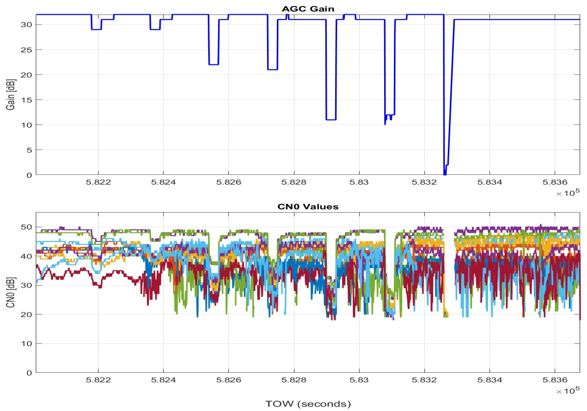
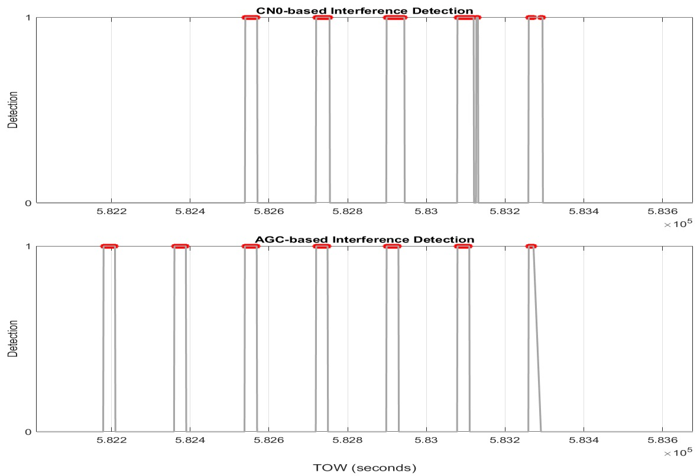

# 论文解读｜GNSS Jamming Detection with Automatic Gain Control (AGC) and Carrier-to-Noise Ratio Density (CNO) Observables from a COTS receiver

- 作者：Syed Ali Kazim, Anas Darwich, Juliette Marais
- 日期：2026-02-13
- 原文：http://arxiv.org/abs/2602.12688v1

## 一句话读懂

这篇论文的核心是把 GNSS 干扰/欺骗从“信号异常”转成可观测、可检测、可比较的接收机状态变化，并比较 AGC、C/N0 等接收机内部观测量在检测任务中的价值。

## 原文线索

- 这篇论文的机器可读文本结构不完整，因此解读主要依据题名、图表和论文元数据；正式引用实验结论前仍建议回到原文逐段核对。
- 阅读时可以先围绕图表建立主线，再回到方法和实验部分确认作者的变量定义、阈值和数据集设置。

## 这篇论文应该怎么读

一篇工程型定位/SLAM 论文，不能只看模型名字和最终指标。建议按七步读：背景痛点、研究问题、输入观测、核心方法、图表证据、局限追问、工程迁移。

## 1. 背景与痛点

- GNSS 在铁路、无人系统和车载定位里常被当作全局位置来源，但它面对干扰、欺骗和遮挡时很脆弱；只看最终位置跳变，往往已经太晚。
- 这类论文真正关心的不是“能不能检测到一次异常”，而是能不能在低成本接收机和真实噪声背景下稳定地区分干扰、正常波动和接收机状态变化。
- 从论文线索看，作者把接收机内部观测量作为检测依据，而不是只依赖最终 PVT 结果。

## 2. 研究问题

- AGC、C/N0 等接收机观测量能否比定位结果更早反映干扰？
- 在不同干扰强度和时间区间下，哪个检测器更敏感，哪个更容易漏检？
- 如果把检测结果接入多传感器定位系统，能否作为 GNSS 观测权重或完整性标志使用？

## 3. 方法拆解

- 输入层：构造或回放 GNSS 信号，并叠加可控干扰；同时记录接收机输出的 C/N0、AGC gain 等内部状态量。
- 检测层：把 AGC/CNO 的变化转成事件边界或检测标志，核心是判断这些变化是否和干扰区间一致。
- 对比层：分别评估 AGC-based detector、CNO-based detector 的响应差异，看低功率干扰、强干扰和不同时间段下的漏检情况。
- 工程层：最值得借鉴的是“先检测观测可信度，再决定 GNSS 是否参与定位融合”的思路。

## 4. 论文图解

图 1：论文原图 1（从 PDF 直接提取）

把这张图当成“观测量响应图”来读：干扰发生时，接收机前端的 AGC、C/N0 或检测量会出现同步变化。阅读重点不是曲线本身，而是变化是否清晰、是否和干扰区间对齐、弱干扰时是否仍能被看见。

图 2：论文原图 2（从 PDF 直接提取）

第二张图通常更接近“检测结果图”或“对比图”：重点比较不同检测器在同一时间轴上的响应差异，尤其是低功率干扰是否漏检、强干扰是否稳定触发。

## 5. 实验和指标怎么看

- 先看实验场景是否可控：干扰信号如何生成、持续多久、功率如何变化、是否有无干扰基线。
- 再看指标是否和任务一致：检测任务要看漏检、误检、检测延迟，而不只是画出曲线变化。
- 图里的 AGC/CNO 曲线要和干扰区间对齐看；如果弱干扰下某个指标不响应，就说明它不能单独作为完整性判据。

## 6. 贡献与局限

- 贡献：把 GNSS 干扰检测落到接收机可观测量上，使检测逻辑更接近真实系统可以在线获取的数据。
- 贡献：通过不同检测器对比，帮助判断 AGC 与 C/N0 在低功率和强干扰下的适用边界。
- 局限：如果干扰类型、接收机型号、天线环境变化，阈值和检测规律可能需要重新标定。
- 局限：检测到干扰不等于完成鲁棒定位，还需要和 INS/视觉/LiDAR 等融合模块共同决定 GNSS 权重。

## 7. 工程启发与复现清单

- 复现第一步：记录原始 GNSS 观测和接收机状态量，不要只保存最终经纬度。
- 复现第二步：把干扰/异常区间标注出来，分别评估 AGC、C/N0、残差和定位跳变的响应。
- 工程接入：把检测结果输出为 GNSS 可信度分数，用来调整融合定位里的观测协方差或剔除策略。
- 上线前检查：不同接收机、不同天线、不同城市环境都要重新校准阈值，避免把遮挡误判为攻击。

## 读完之后可以追问

- 如果攻击不是线性 chirp，而是更隐蔽的 spoofing 或 meaconing，指标是否仍然敏感？
- 检测器能否输出连续可信度，而不是只输出 0/1 告警？
- 和 IMU、视觉、LiDAR 融合后，GNSS 异常检测应该在前端、后端还是完整性监测层处理？

> 图像来自论文 PDF，仅用于论文解读和学术讨论，正式转载前建议核对论文许可和作者要求。
