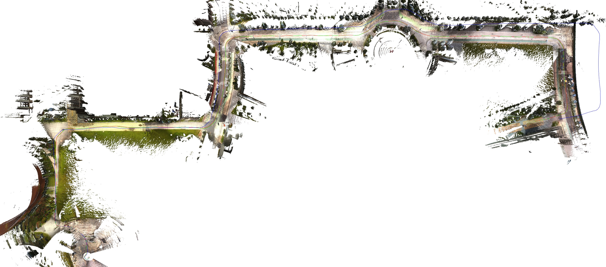
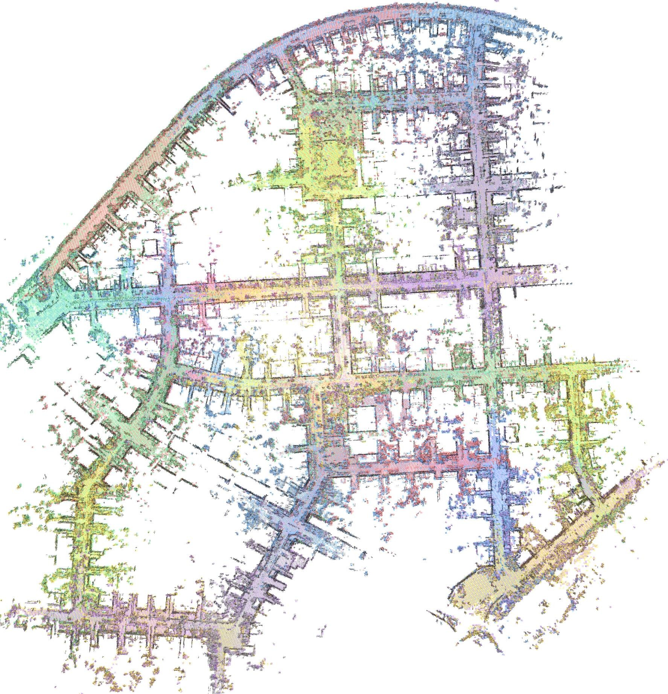

# 论文解读｜LXD-SLAM：LiDAR+X 稠密 SLAM，32 种传感器组合

- 作者：波波机器人
- 论文作者：Zhong Wang, Lin Zhang, Linfei Li, Ying Shen 等
- 日期：2026-06-26
- 原文：http://arxiv.org/abs/2606.27811v1

## 一句话读懂

这篇论文的核心是回答多传感器融合系统在 GNSS 受限、传感器退化或场景变化时，如何用可配置的观测组合维持稳定定位和一致建图。

## 读前抓手

- 原文主线围绕多传感器融合的稳定定位展开；阅读时要追踪每个传感器提供的是先验、运动约束、几何约束还是全局约束。
- 如果论文强调 configurable、cross-session 或 dense mapping，就要额外关注系统在传感器缺失和场景变化下是否仍保持同一套估计逻辑。
- 从可抽取文本中反复出现的术语看，建议跟踪这些线索：GNSS, LiDAR, visual, inertial, SLAM, odometry, mapping, fusion。

## 故事版导读

《LXD-SLAM：LiDAR+X 稠密 SLAM，32 种传感器组合》讲的是一个多传感器团队协作的故事：LiDAR、相机、IMU、GNSS 各自都有长处，也都会在某些场景里掉链子。论文关心的不是把传感器堆得越多越好，而是当某个传感器失效、某段场景退化或 GNSS 不可靠时，系统还能不能用同一套逻辑继续定位和建图。 从摘要抽取到的线索看，后文会围绕 LiDAR, inertial, SLAM, mapping, fusion 展开。

## 章节精读

### 1. 背景和问题：论文为什么值得读

LXD-SLAM 盯住的是机器人部署里的一个硬问题：平台上可能有 LiDAR、相机、IMU、轮速计、GNSS，但不同机器人、不同任务、不同环境拿到的传感器组合并不一样。作者把 3D LiDAR 作为核心锚点，再让其它模态以可插拔方式加入同一套估计和建图框架。文中这一段反复出现的线索是 LiDAR, IMU, SLAM, mapping, detection, fusion。

- 多传感器融合的难点不是把 LiDAR、相机、IMU、GNSS 都接进系统，而是在不同场景下知道哪些观测可信、哪些观测应该降权或剔除。
- GNSS 受限、几何退化、动态物体和跨会话环境变化都会破坏单一传感器假设，因此论文需要证明系统在这些不完美条件下仍能闭环工作。
- 系统能否在不同传感器组合下保持同一套估计框架，而不是为每种组合重写一套管线？
- LiDAR、视觉、IMU、GNSS 在前端或后端分别提供什么约束，失效时如何降级？

### 2. 方法拆解：作者真正搭了哪台机器

方法由三层咬合起来：前端用 IESKF 做统一状态估计，预测阶段按可用传感器选择 IMU、轮速计或恒速模型；更新阶段以 LiDAR 点到 mesh 的距离为主约束，视觉可用时再加入重投影误差。地图层用多层 GP sub-mesh 表达连续表面，后端再用 ESC、视觉 Bidirectional PnP、GNSS/odometry 约束放进混合位姿图，修正长期漂移。文中这一段反复出现的线索是 GNSS, LiDAR, camera, inertial, IMU, SLAM。

- 可配置输入：系统以 3D LiDAR 为核心，额外支持 Camera、IMU、Wheel Encoder、GNSS；五类模态构成 power set，因此标题里的组合数是 32。
- 预测层：IESKF 的预测不是固定公式，IMU 可用时优先做高频传播，轮速计可用时提供地面平台运动先验，都缺失时退回恒速模型。
- 更新层：LiDAR 点云不再只做点到平面，而是和多层 GP sub-mesh 做 point-to-mesh 约束；相机可用时，光流跟踪的成熟特征再贡献重投影误差。
- 地图层：环境被拆成局部 sub-mesh，每个网格可拟合多层 Gaussian Process 表面，这让系统既能做稠密 mesh，也能给视觉特征做 ray-to-mesh 深度恢复。
- 后端层：ESC 描述子负责 LiDAR 拓扑回环，Bidirectional PnP 负责视觉回环，GNSS 和 odometry 约束一起进入混合位姿图，目标是同时修轨迹和修地图。

### 3. 主图和关键图解：先沿着数据流走一遍

主图：System Overview

这张图适合当作论文的“主地图”来读：左侧是传感器或数据输入，中间是同步、融合、检测、建图或优化模块，右侧是定位、地图或告警输出。读它时不要急着看细节，先沿着箭头走一遍数据流，就能知道作者到底把创新点放在前端观测、后端优化，还是系统组织方式上。

论文图：Hierarchical map organization

第二张图适合看对比和细节：不同传感器组合、不同场景或不同退化条件下，系统是否还能保持地图一致和定位稳定。

### 4. 实验验证：证据链是否站得住

实验需要按传感器组合逐组读：作者声称最多支持 32 种组合，所以证据不只是一条最优轨迹，而是不同配置下是否能接近或超过专用 SOTA，并且能实时输出全局一致的稠密 mesh。文中这一段反复出现的线索是 LiDAR, camera, IMU, SLAM, odometry, fusion。

- 第一层证据是组合覆盖：LXD-SLAM 不是只展示 LiDAR+IMU 的最强配置，而是要证明 LiDAR+X 的多种配置能共用同一估计框架。
- 第二层证据是对标专用系统：如果某个固定组合已经有成熟 SOTA，LXD-SLAM 至少要在精度上接近它，否则“统一框架”会牺牲性能。
- 第三层证据是地图质量：论文强调 dense mesh，就不能只看 ATE/RPE，还要看 mesh 是否连续、是否重影、回环后局部结构有没有撕裂。
- 第四层证据是实时性：GP sub-mesh、视觉 ray tracing、ESC、混合位姿图都很重，读实验时要留意帧率、内存和大场景增长趋势。
- 第五层证据是退化场景：长隧道、开阔地、窄视场 LiDAR、GNSS 受限和视觉贫纹理，才真正考验可配置融合是否有意义。

### 5. 贡献边界和复现：哪些能迁移，哪些要小心

结论的价值在于把模块化、统一滤波、稠密 mesh 和多模态回环连到一起；边界也很明显，组合越灵活，对标定、同步、算力和地图维护的要求越高。文中这一段反复出现的线索是 GNSS, LiDAR, visual, camera, inertial, IMU。

- 贡献：把多种传感器约束放到统一定位/建图框架里，降低了单一传感器退化带来的系统风险。
- 贡献：如果系统支持多种组合，就更接近真实平台，因为工程现场经常会遇到某个传感器缺失或质量下降。
- 局限：多模态系统高度依赖同步和标定，论文指标好不代表部署后也能稳定复现。
- 局限：dense mapping 或大尺度建图可能带来显著计算和存储成本，需要看实时性边界。
- 复现第一步：先搭最小可运行组合，例如 LiDAR+IMU 或 VIO，再逐步加入 GNSS/视觉/热成像等额外观测。
- 复现第二步：建立传感器质量监控，记录同步误差、外参漂移、观测残差和异常剔除比例。

## 读完之后可以追问

- 哪一个传感器失效时系统最脆弱，论文有没有给出清晰的降级路径？
- 标定误差和时间同步误差对结果影响有多大？
- 如果换成低成本传感器或更大规模地图，计算和存储是否还能接受？

> 图像来自论文 PDF，仅用于论文解读和学术讨论，正式转载前建议核对论文许可和作者要求。
