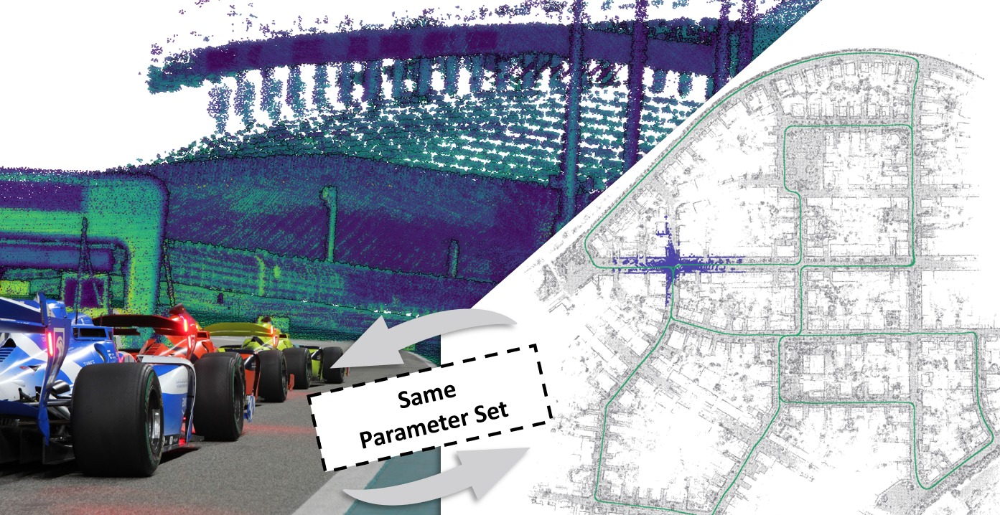

# 论文解读｜FAR-LIO: Enabling High-Speed Autonomy through Fast, Accurate, and Robust LiDAR-Inertial Odometry

- 作者：波波机器人
- 论文作者：Maximilian Leitenstern, Marcel Weinmann, Patrick Haft, Tobias Lasser 等
- 日期：2026-06-24
- 原文：http://arxiv.org/abs/2606.26010v1

## 阅读原文

- [原文页面](http://arxiv.org/abs/2606.26010v1)
- [PDF下载](https://arxiv.org/pdf/2606.26010v1)
- [代码/项目](https://github.com/TUMFTM/FAR-LIO)

## 一句话读懂

这篇论文聚焦移动机器人定位与建图系统面临的挑战，即“单一传感器在遮挡、稀疏几何、动态物体或长距离运行中容易失去稳定约束”。其核心亮点在于，方法主线通过传感器融合、几何约束、地图表达、回环检测或学习式前端，将输入、处理和输出紧密衔接。值得一提的是，相关性能指标达到了 250 km/h。

## 读前抓手

- 题目里最值得先圈出的词是：robust, odometry, lidar-inertial, lio, SLAM, LiDAR, IMU, VIO。它们把文章带到室内外移动机器人、自动驾驶或大尺度建图场景，也暗示后面要解决单一传感器会在遮挡、稀疏几何、动态物体或长距离运行中失去稳定约束。
- 摘要先交代问题：移动机器人定位与建图系统面对的核心风险是单一传感器会在遮挡、稀疏几何、动态物体或长距离运行中失去稳定约束；可以重点看 Fast, Accurate, Robust。这决定了文章的重点不是堆结果，而是解释问题为什么会发生。
- 接着看做法：方法主线是围绕传感器融合、几何约束、地图表达、回环检测或学习式前端把输入、处理和输出连起来；相关数字包括 250 km/h。方法部分优先找清楚输入、假设、核心运算和输出。
- 图注里反复出现 LiDAR，这些词多半对应系统流程、实验设置或结果展示，读图时可以先从这里入手。

## 故事版导读

阅读《FAR-LIO: Enabling High-Speed Autonomy through Fast, Accurate, and Robust LiDAR-Inertial Odometry》时，我们可以首先将关注点放在室内外移动机器人、自动驾驶或大尺度建图等应用场景。这些场景中，移动机器人定位与建图系统面临的核心挑战是：单一传感器在遮挡、稀疏几何、动态物体或长距离运行中容易失去稳定约束。论文的亮点在于其 Fast, Accurate, Robust 的特性。接着，作者在方法论上，其主线围绕传感器融合、几何约束、地图表达、回环检测或学习式前端，将输入、处理与输出环节有机结合起来；相关性能指标达到了 250 km/h。进入实验部分，作者通过轨迹误差、地图一致性、传感器退化、跨数据集对比和实时性验证，来证明所提出的问题是否得到有效解决；这里可以重点关注 VIO, dataset, TABLE III, OMPONENT- WISE ABLATION, STUDY 等部分。最后，回到工程实践问题，论文的结论应关注SLAM前端/后端、地图维护、传感器降级以及部署时的算力预算等考量；可以重点关注 dataset, Utilizing, FAR- LIO, Key Design Choices, FAR-LIO 等内容。通过这样的阅读路径，论文不再是零散的模块堆砌，而是一条从问题风险、解决方案、实验验证到工程落地边界的完整脉络。

## 章节精读

### 1. 背景和问题：先看矛盾从哪来

开篇先把矛盾摆出来：移动机器人定位与建图系统原本依赖稳定输入工作，但现场会遇到单一传感器会在遮挡、稀疏几何、动态物体或长距离运行中失去稳定约束。移动机器人定位与建图系统面对的核心风险是单一传感器会在遮挡、稀疏几何、动态物体或长距离运行中失去稳定约束；可以重点看 Fast, Accurate, Robust。读这一段时，不必急着记术语，先看清作者认为“危险”到底发生在哪个环节。

- 场景压力：可以重点看 LiDAR, IMU, dataset, Most, Fig，说明论文把问题放在室内外移动机器人、自动驾驶或大尺度建图场景里看，定位结果会继续影响后续通信、控制或授时。
- 失效来源：原文强调的是 [1].，危险点在于输入被污染后，移动机器人定位与建图系统仍可能给出像正常一样的输出。
- 作者抓住的变量：可以重点看 Fast, Accurate, Robust，这就是后文要反复跟踪的观测量、攻击参数或系统状态。
- 这对定位系统的影响：可以重点看 LiDAR, navigation, odometry, robot, Vizzo，影响会从单个观测扩散到SLAM 前端/后端、地图维护、传感器降级和部署算力预算。

### 2. 方法拆解：把做法拆成输入、核心动作和输出

方法部分可以当作一条处理链来看：输入是什么，传感器融合、几何约束、地图表达、回环检测或学习式前端怎样把信息组织起来，最后又怎样服务于SLAM 前端/后端、地图维护、传感器降级和部署算力预算。方法主线是围绕传感器融合、几何约束、地图表达、回环检测或学习式前端把输入、处理和输出连起来；相关数字包括 250 km/h。这样读会比逐个背模块名轻松，也更容易看出作者真正改动了哪里。

- 输入/观测：相关数字包括 250 km/h，先确认这些输入是实测、回放、仿真，还是由模型生成。
- 核心步骤：可以重点看 FAR-LIO, Maximilian Leitenstern, Marcel Weinmann, Dominik Kulmer, Markus Lienkamp，把这些步骤按时间顺序串起来，就是论文的主处理链。
- 模型或检测量：可以重点看 FAR-LIO，读到这里要分清哪些是可测变量，哪些是作者构造出的判断量。
- 输出形式：可以重点看 localization，输出必须能被后续模块消费，才有机会接入SLAM 前端/后端、地图维护、传感器降级和部署算力预算。
- 接入方式：可以重点看 LiDAR, odometry, LIO，工程接入时要明确它改变告警、权重、地图还是控制决策。

### 3. 主图和关键图解：先沿着数据流走一遍

主图：架构 Overview of FAR-LIO

原图注可译为：“FAR-LIO 的架构概览。蓝色模块在 CPU 上执行，而绿色模块则使用 GPU 进行加速。”这张图清晰地展示了论文的整体组织方式：传感器或观测数据如何输入系统，中间经过哪些估计、融合或更新模块进行处理，最终形成状态、地图或告警结果。

论文图：评估 of computation times per LiDAR scan

原图注可译为：“每帧 LiDAR 扫描的计算时间评估。每种算法展示两种结果：左侧柱状图代表自主赛车数据，包含 3”。这类结果图主要用于回答“实验验证是否充分”：即场景覆盖是否全面，所用指标是否足以支撑作者的结论，以及失败或退化场景是否得到清晰展示。

### 4. 实验验证：看数据、场景和指标是否对得上问题

实验部分重点看证据链是否完整：数据从哪里来，场景够不够真实，指标是否能说明问题。这篇会围绕轨迹误差、地图一致性、传感器退化、跨数据集对比和实时性展开验证。实验主线是用轨迹误差、地图一致性、传感器退化、跨数据集对比和实时性验证问题是否真的被触碰到；可以重点看 VIO, dataset, TABLE III, OMPONENT- WISE ABLATION, STUDY。如果图表里能同时看到成功样例和困难样例，结论就更有参考价值。

- 数据来源：可以重点看 Unlike, FAR-LIO，先看数据来自真实设备、公开数据集还是仿真环境。
- 实验场景：可以重点看 VIO, dataset, TABLE III, OMPONENT- WISE ABLATION, STUDY，场景越贴近室内外移动机器人、自动驾驶或大尺度建图场景，结论越值得迁移。
- 对比指标：可以重点看 These, Fig，这里要看指标是否直接对应单一传感器会在遮挡、稀疏几何、动态物体或长距离运行中失去稳定约束。
- 结果读法：可以重点看 LiDAR, IMU, RSLCPP, APE，重点不是单个数值好看，而是强弱场景和失败样本能否解释得通。
- 失败边界：原文强调的是 This demonstrates that its emphasis on efficiency does not sacrifice accuracy.，这些边界决定方法换平台后要重新标定什么。

### 5. 贡献边界和复现：把亮点翻成工程判断

最后再看边界：作者证明了什么，哪些条件下成立，换到自己的平台是否还需要重做标定或实验。对工程读者来说，关键是它能否接到SLAM 前端/后端、地图维护、传感器降级和部署算力预算。结论要落到SLAM 前端/后端、地图维护、传感器降级和部署算力预算；可以重点看 dataset, Utilizing, FAR- LIO, Key Design Choices, FAR-LIO。

- 主要贡献：可以重点看 dataset, Utilizing, FAR- LIO, Key Design Choices, FAR-LIO，贡献要回到SLAM 前端/后端、地图维护、传感器降级和部署算力预算才有工程价值。
- 适用条件：可以重点看 LiDAR, odometry, FAR-LIO, Fast, Accurate，这些条件决定论文结论能不能迁移到自己的传感器和场景。
- 工程收益：可以重点看 odometry, CUDA-accelerated, GICP, CUDA-based, Delay Compensation，真正的收益是减少误信、漂移、漏检或计算开销。
- 需要复核的边界：可以重点看 These，复现时要优先检查数据、参数、同步和评价脚本。

## 读完之后可以追问

- 如果把 robust 换到自己的机器人或车辆平台，最先需要重新标定的是输入数据、阈值，还是传感器外参？
- 论文里的证据是否覆盖了室内外移动机器人、自动驾驶或大尺度建图场景里最容易失败的场景，还是只证明了一个受控设置？
- 这套做法接入SLAM 前端/后端、地图维护、传感器降级和部署算力预算时，应该输出连续可信度、离散告警，还是直接改变优化权重？

> 图像来自论文 PDF，仅用于论文解读和学术讨论，正式转载前建议核对论文许可和作者要求。
