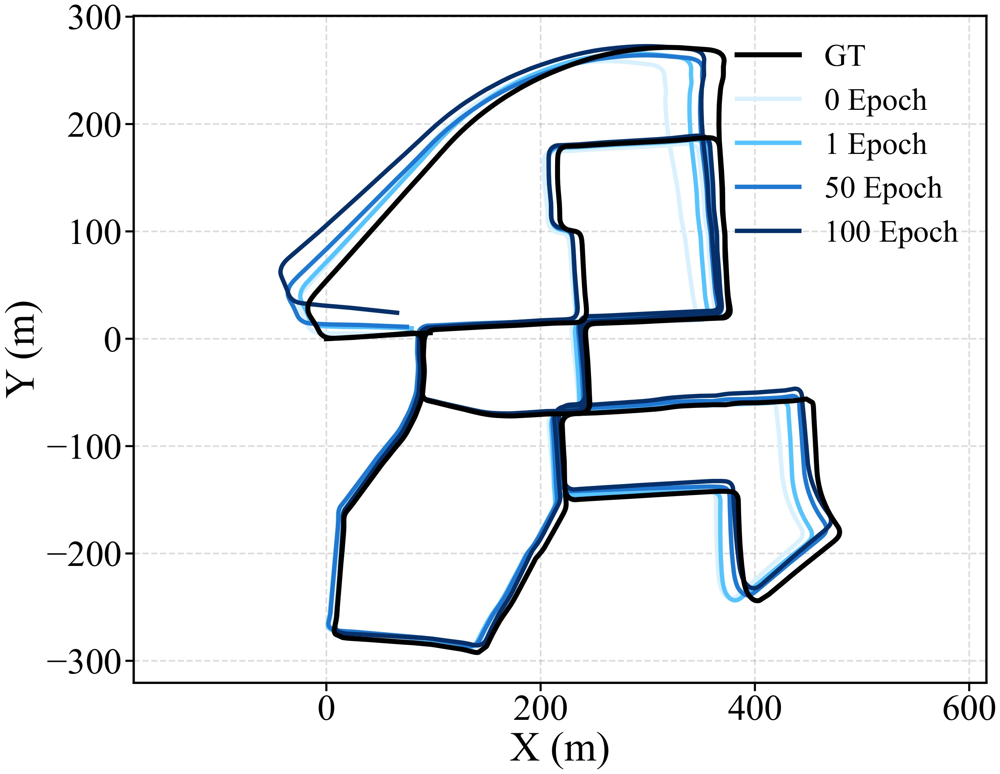

# 论文解读｜Self-supervised Geometry Reasoning for LiDAR Simultaneous Localization and Mapping

- 作者：波波机器人
- 论文作者：Jiwoo Kim, Jinwoo Lee, Woojae Shin, Giseop Kim 等
- 日期：2026-06-29
- 原文：http://arxiv.org/abs/2606.30166v1

## 一句话读懂

这篇论文的核心是把局部几何、匹配约束或地图表达做得更可靠，从而改进 SLAM/里程计在复杂几何、稀疏点云或退化场景下的状态估计。

## 读前抓手

- 原文主线围绕 SLAM/里程计中的几何表达或估计稳定性展开；阅读时要把局部几何、匹配关系和后端优化联系起来看。
- 如果作者引入自监督、学习式几何或新地图表达，关键是看它最终如何影响轨迹误差、局部地图质量和退化场景鲁棒性。
- 从可抽取文本中反复出现的术语看，建议跟踪这些线索：LiDAR, SLAM, mapping。

## 故事版导读

《Self-supervised Geometry Reasoning for LiDAR Simultaneous Localization and Mapping》可以当成一个“机器人怎样不迷路”的故事：前端看到的是稀疏、嘈杂、动态的世界，后端却需要输出连续、可信的轨迹和地图。作者把切入点放在几何表示、匹配约束和地图更新的稳定性上，减少一个局部错误一路放大成全局漂移。 从摘要抽取到的线索看，后文会围绕 LiDAR, SLAM, mapping 展开。

## 章节精读

### 1. 背景和问题：论文为什么值得读

这篇论文从 LiDAR SLAM 的局部几何瓶颈切入：稀疏点云、低线数 LiDAR 和噪声会让手工估计的协方差、对应关系、表面结构变得不稳定，前端一旦给出脏约束，后端轨迹和地图都会被拖偏。

- SLAM/里程计的老问题是：前端几何估计不稳定会一路传导到后端优化，最后表现为漂移、错配或地图撕裂。
- 复杂几何、低分辨率 LiDAR、稀疏区域和动态场景会让手工几何估计变得脆弱，因此作者往往试图让局部几何或匹配约束更可靠。
- 局部几何到底如何被表示：协方差、平面、曲率、对应关系，还是可学习的几何特征？
- 这种表示如何进入 SLAM：影响点云匹配、残差权重、后端约束，还是地图更新？

### 2. 方法拆解：作者真正搭了哪台机器

方法把每个点看成一个带协方差的高斯分布，用神经模块预测局部几何，再用符号推理模块检查两类一致性：对应点残差是否能被协方差解释，协方差诱导出的位姿是否和 SLAM 记忆中的位姿一致。随后把推理后的几何反馈给 SLAM，更新轨迹和对应关系，形成几何和轨迹互相修正的闭环。文中这一段反复出现的线索是 LiDAR, IMU, SLAM。

- 几何表示：每个 LiDAR 点被看成 3D Gaussian，协方差描述局部表面形状；稀疏点云里，协方差比单个点坐标更能表达“这个点附近像不像一片稳定表面”。
- 自监督来源：模型不用真值位姿或 dense geometry 标签，而是用对应点残差和 SLAM 估计轨迹之间的一致性来训练局部协方差。
- 推理模块：对应 likelihood 检查点对残差能否被协方差解释；pose likelihood 检查由协方差诱导出的位姿是否贴近记忆中的 SLAM 位姿。
- 反馈闭环：训练出的 covariance estimator 会把高各向异性的点用于采样增密，增密点云再送进 SLAM 后端更新轨迹和对应关系。
- 工程价值：它不是替换整个 SLAM，而是作为几何增强模块插到现有 LiDAR SLAM 前端，让低线数或稀疏输入更接近高质量几何约束。

### 3. 主图和关键图解：先沿着数据流走一遍

主图：A visualization illustrating how the underlying geom-

这张图是在解释几何建模或约束构造。读图时先分清输入点、局部几何、对应关系和位姿变换分别是什么，再看这些量如何进入 SLAM 前端或后端。

论文图：Raw and densified point clouds

这张图更适合看结果验证：轨迹是否贴近真值、迭代是否收敛、地图或局部结构是否因为新模块变得更稳定。

### 4. 实验验证：证据链是否站得住

实验把 KITTI Sequence 00 降采样成 64、32、16 线 LiDAR 设置，用 VGICP 作为后端，比较原始点云和几何推理后点云。读实验时要同时看 300 帧区间 RPE、全局配准成功率和稀疏输入下的收益，因为这决定它是否真的帮 SLAM 抗退化。

- 数据设置很克制：作者用 KITTI odometry Sequence 00，把原始 64 线点云降采样成 32 线和 16 线，专门观察稀疏输入下几何推理是否有价值。
- 后端不是作者重写的庞大系统，而是轻量 VGICP；这能说明模块更像一个可插拔几何增强层，而不是依赖特定后端的整套工程。
- 里程计指标用 300 帧区间 translational RPE。结果显示 16 线和 32 线在 2-step 后误差分别下降约 49.5% 和 47.8%，64 线只下降约 6.0%，说明收益主要来自稀疏场景。
- 全局配准用 TEASER，随机采 100 对距离 10m 内的扫描对，成功条件是旋转误差小于 10 度、平移误差小于 2m。
- 配准结果也符合直觉：32 线在 1-step 时成功率提升约 6.7%，64 线本来几何就足够好，后续提升更有限。

### 5. 贡献边界和复现：哪些能迁移，哪些要小心

结论把贡献收束到“无真值标签学习局部几何”上；限制也很清楚，训练时间、采样策略和停止准则还会影响它能否广泛接入工程系统。

- 贡献：围绕局部几何或地图表达改进 SLAM 的关键薄弱环节，有助于减少前端错误向后端传播。
- 贡献：如果实验包含消融和退化场景，说明方法不只是调参，而是在机制上提高了鲁棒性。
- 局限：局部几何方法高度依赖点云密度、传感器噪声和场景结构，跨平台迁移需要重新验证。
- 局限：如果训练或参数选择依赖特定数据集，部署到新城市、新建筑或低成本雷达时可能退化。
- 复现第一步：确认论文新增模块位于前端、后端还是地图表达层，避免把整个系统一次性重写。
- 复现第二步：先在公开数据集上复现轨迹指标，再看局部地图和失败案例，不要只看平均误差。

## 读完之后可以追问

- 新增几何模块在极端稀疏或动态场景中是否仍有效？
- 它提升的是前端匹配质量，还是后端优化的稳定性？
- 如果不使用作者的数据集和参数，方法是否仍能泛化？

> 图像来自论文 PDF，仅用于论文解读和学术讨论，正式转载前建议核对论文许可和作者要求。
