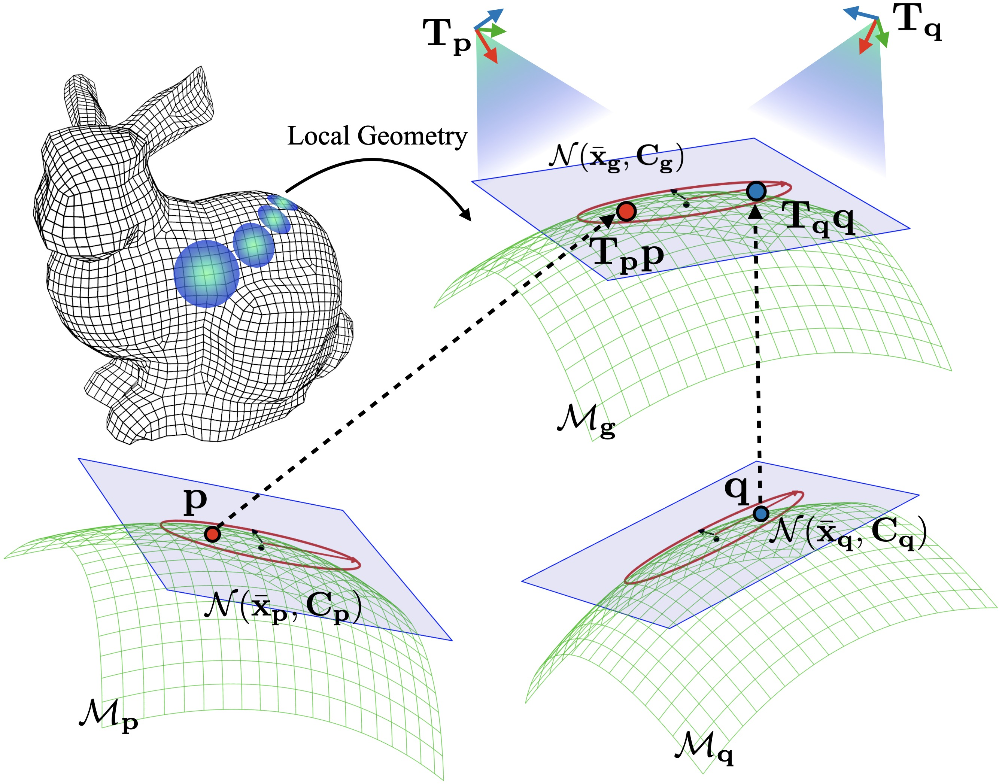

# 论文解读｜Self-supervised Geometry Reasoning for LiDAR Simultaneous Localization and Mapping

- 作者：Jiwoo Kim, Jinwoo Lee, Woojae Shin, Giseop Kim 等
- 日期：2026-06-29
- 原文：http://arxiv.org/abs/2606.30166v1

## 一句话读懂

这篇论文的核心是把局部几何、匹配约束或地图表达做得更可靠，从而改进 SLAM/里程计在复杂几何、稀疏点云或退化场景下的状态估计。

## 原文线索

- 这篇论文的机器可读文本结构不完整，因此解读主要依据题名、图表和论文元数据；正式引用实验结论前仍建议回到原文逐段核对。
- 阅读时可以先围绕图表建立主线，再回到方法和实验部分确认作者的变量定义、阈值和数据集设置。

## 这篇论文应该怎么读

一篇工程型定位/SLAM 论文，不能只看模型名字和最终指标。建议按七步读：背景痛点、研究问题、输入观测、核心方法、图表证据、局限追问、工程迁移。

## 1. 背景与痛点

- SLAM/里程计论文的背景通常是：前端几何估计不稳定会一路传导到后端优化，最后表现为漂移、错配或地图撕裂。
- 复杂几何、低分辨率 LiDAR、稀疏区域和动态场景会让手工几何估计变得脆弱，因此作者往往试图让局部几何或匹配约束更可靠。
- 从题目《Self-supervised Geometry Reasoning for LiDAR Simultaneous Localization and Mapping》看，这篇论文适合重点关注它如何定义局部几何、如何训练/估计，以及它是否真的改善 SLAM 轨迹和地图质量。

## 2. 研究问题

- 局部几何到底如何被表示：协方差、平面、曲率、对应关系，还是可学习的几何特征？
- 这种表示如何进入 SLAM：影响点云匹配、残差权重、后端约束，还是地图更新？
- 实验是否证明它改善了轨迹精度、收敛速度和退化场景稳定性，而不是只在可视化上更好看？

## 3. 方法拆解

- 输入层：从点云、局部邻域或连续帧中构造几何信息，重点看局部结构是否足够稳定。
- 表示层：把几何关系编码为协方差、曲面、对应关系或可学习特征，目标是减少稀疏和噪声带来的不稳定。
- 优化层：这些几何信息会进入匹配、残差权重、回环或地图更新，最终影响轨迹和地图一致性。
- 验证层：最有说服力的是消融实验和退化场景对比，能说明新增模块不是只带来额外计算量。

## 4. 论文图解

图 1：论文原图 1（从 PDF 直接提取）

这类图往往是在解释几何建模或约束构造。读图时先分清输入点、局部几何、对应关系和位姿变换分别是什么，再看这些量如何进入 SLAM 前端或后端。

图 2：论文原图 2（从 PDF 直接提取）

这张图更适合看结果验证：轨迹是否贴近真值、迭代是否收敛、地图或局部结构是否因为新模块变得更稳定。

## 5. 实验和指标怎么看

- 先看轨迹指标：绝对轨迹误差、相对位姿误差、回环前后漂移是否明显改善。
- 再看地图质量：局部结构是否更锐利，重建是否有重影、撕裂或尺度漂移。
- 最后看消融和泛化：只在一个数据集有效的几何模块，工程迁移价值会打折。

## 6. 贡献与局限

- 贡献：围绕局部几何或地图表达改进 SLAM 的关键薄弱环节，有助于减少前端错误向后端传播。
- 贡献：如果实验包含消融和退化场景，说明方法不只是调参，而是在机制上提高了鲁棒性。
- 局限：局部几何方法通常依赖点云密度、传感器噪声和场景结构，跨平台迁移需要重新验证。
- 局限：如果训练或参数选择依赖特定数据集，部署到新城市、新建筑或低成本雷达时可能退化。

## 7. 工程启发与复现清单

- 复现第一步：确认论文新增模块位于前端、后端还是地图表达层，避免把整个系统一次性重写。
- 复现第二步：先在公开数据集上复现轨迹指标，再看局部地图和失败案例，不要只看平均误差。
- 工程接入：如果模块只改变局部几何或权重，可以优先做成可插拔前端，而不是侵入整个 SLAM 后端。
- 上线前检查：用低纹理、稀疏点云、动态物体和闭环失败场景做压力测试。

## 读完之后可以追问

- 新增几何模块在极端稀疏或动态场景中是否仍有效？
- 它提升的是前端匹配质量，还是后端优化的稳定性？
- 如果不使用作者的数据集和参数，方法是否仍能泛化？

> 图像来自论文 PDF，仅用于论文解读和学术讨论，正式转载前建议核对论文许可和作者要求。
