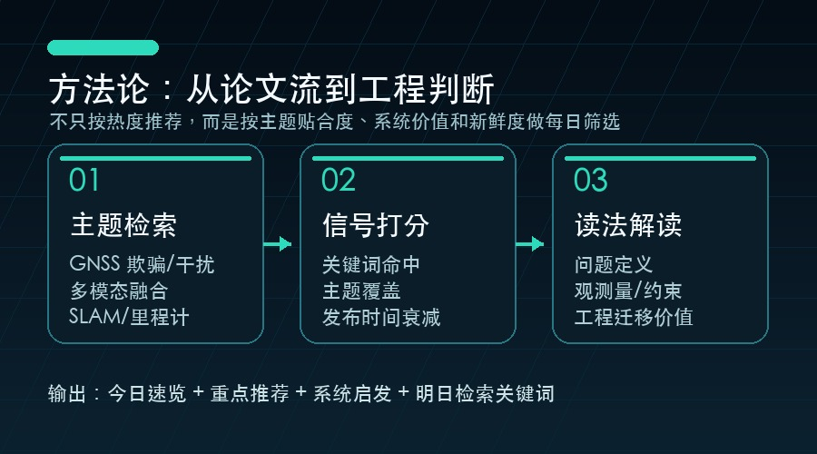

# 每日 GNSS 欺骗检测 / 多模态融合 / SLAM 论文推荐 | 2026-07-03

今天的推荐聚焦三个交叉点：GNSS 欺骗/干扰检测、多模态融合定位、SLAM 与鲁棒里程计。筛选逻辑优先考虑主题相关性、新近度、引用/venue/开源代码等质量信号，以及是否能给工程系统带来可验证的思路。

## 筛选方法论

这份日报不是简单按 arXiv 最新排序，而是先用主题查询收集候选论文，再做标题级去重，并按关键词命中、主题覆盖、发布时间、引用/venue/代码/数据集线索和工程迁移价值排序。阅读时建议重点看：问题定义是否清晰、观测量是否可靠、融合位置是否合理、实验是否覆盖失败案例。

## 今日速览

1. **GNSS Jamming Detection with Automatic Gain Control (AGC) and Carrier-to-Noise Ratio Density (CNO) Observables from a COTS receiver**
   - 作者：Syed Ali Kazim, Anas Darwich, Juliette Marais
   - 日期：2026-02-13
   - 链接：http://arxiv.org/abs/2602.12688v1
   - 质量信号：质量分 0.0；venue 7th SmartRacon scientific seminar, Oct 2025, Stuttgart, Germany
   - 推荐理由：主题贴合 邮件指定关键词、GNSS 欺骗与干扰检测，关键词集中在 gnss jamming、gnss、gps、spoofing、jamming、interference、integrity、detection。质量信号：venue 7th SmartRacon scientific seminar, Oct 2025, Stuttgart, Germany，适合作为今日跟踪论文。
2. **GenAI for Energy-Efficient and Interference-Aware Compressed Sensing of GNSS Signals on a Google Edge TPU**
   - 作者：Thorben Wegner, Lucas Heublein, Tobias Feigl, Felix Ott 等
   - 日期：2026-05-14
   - 链接：http://arxiv.org/abs/2605.14839v1
   - 质量信号：质量分 6.5；venue IEEE/ION Position, Location and Navigation Symposium (PLANS), Salt Lake City, UT
   - 推荐理由：主题贴合 邮件指定关键词、GNSS 欺骗与干扰检测，关键词集中在 gnss jamming、gnss、spoofing、jamming、interference、receiver。质量信号：venue IEEE/ION Position, Location and Navigation Symposium (PLANS), Salt Lake City, UT，适合作为今日跟踪论文。
3. **Quantum Kernels for Audio Deepfake Detection Using Spectrogram Patch Features**
   - 作者：Lisan Al Amin, Rakib Hossain, Mahbubul Islam, Faisal Quader 等
   - 日期：2026-05-07
   - 链接：http://arxiv.org/abs/2605.06035v1
   - 质量信号：质量分 0.0；暂无外部质量元数据
   - 推荐理由：主题贴合 邮件指定关键词、GNSS 欺骗与干扰检测，关键词集中在 spoofing detection、spoofing、detection、receiver。质量信号以主题相关和新近度为主，适合作为今日跟踪论文。

## 重点推荐

### 1. GNSS Jamming Detection with Automatic Gain Control (AGC) and Carrier-to-Noise Ratio Density (CNO) Observables from a COTS receiver

- **论文信息**：Syed Ali Kazim, Anas Darwich, Juliette Marais；2026-02-13；eess.SP
- **原文链接**：http://arxiv.org/abs/2602.12688v1
- **关键词**：gnss jamming、gnss、gps、spoofing、jamming、interference、integrity、detection、receiver
- **质量信号**：质量分 0.0；venue 7th SmartRacon scientific seminar, Oct 2025, Stuttgart, Germany
- **为什么值得读**：这篇论文同时覆盖 邮件指定关键词、GNSS 欺骗与干扰检测，并在标题/摘要中出现 gnss jamming、gnss、gps、spoofing、jamming、interference、integrity、detection、receiver 等信号；质量侧还有 质量分 0.0；venue 7th SmartRacon scientific seminar, Oct 2025, Stuttgart, Germany。它适合用来观察该方向近期如何处理鲁棒性、异常检测或融合估计问题。
- **对 GNSS/融合/SLAM 系统的启发**：可借鉴其异常定义和误报抑制思路，把 GNSS 可信度作为状态估计输入的一部分，而不是孤立阈值。
- **摘要要点**：从题名与摘要看，论文主要关注 GNSS 欺骗/干扰场景下的异常识别与完整性监测；方法线索包括 gnss jamming、gnss、gps、spoofing、jamming、interference。阅读全文时建议重点看 可观测量设计、误报控制、攻击与非攻击故障的区分方式，再判断是否适合迁移到自己的工程链路。

### 2. GenAI for Energy-Efficient and Interference-Aware Compressed Sensing of GNSS Signals on a Google Edge TPU

- **论文信息**：Thorben Wegner, Lucas Heublein, Tobias Feigl, Felix Ott 等；2026-05-14；cs.LG
- **原文链接**：http://arxiv.org/abs/2605.14839v1
- **关键词**：gnss jamming、gnss、spoofing、jamming、interference、receiver
- **质量信号**：质量分 6.5；venue IEEE/ION Position, Location and Navigation Symposium (PLANS), Salt Lake City, UT
- **为什么值得读**：这篇论文同时覆盖 邮件指定关键词、GNSS 欺骗与干扰检测，并在标题/摘要中出现 gnss jamming、gnss、spoofing、jamming、interference、receiver 等信号；质量侧还有 质量分 6.5；venue IEEE/ION Position, Location and Navigation Symposium (PLANS), Salt Lake City, UT。它适合用来观察该方向近期如何处理鲁棒性、异常检测或融合估计问题。
- **对 GNSS/融合/SLAM 系统的启发**：可借鉴其异常定义和误报抑制思路，把 GNSS 可信度作为状态估计输入的一部分，而不是孤立阈值。
- **摘要要点**：从题名与摘要看，论文主要关注 GNSS 欺骗/干扰场景下的异常识别与完整性监测；方法线索包括 gnss jamming、gnss、spoofing、jamming、interference、receiver。阅读全文时建议重点看 可观测量设计、误报控制、攻击与非攻击故障的区分方式，再判断是否适合迁移到自己的工程链路。

### 3. Quantum Kernels for Audio Deepfake Detection Using Spectrogram Patch Features

- **论文信息**：Lisan Al Amin, Rakib Hossain, Mahbubul Islam, Faisal Quader 等；2026-05-07；cs.SD
- **原文链接**：http://arxiv.org/abs/2605.06035v1
- **关键词**：spoofing detection、spoofing、detection、receiver
- **质量信号**：质量分 0.0；暂无外部质量元数据
- **为什么值得读**：这篇论文同时覆盖 邮件指定关键词、GNSS 欺骗与干扰检测，并在标题/摘要中出现 spoofing detection、spoofing、detection、receiver 等信号；质量侧还有 质量分 0.0；暂无外部质量元数据。它适合用来观察该方向近期如何处理鲁棒性、异常检测或融合估计问题。
- **对 GNSS/融合/SLAM 系统的启发**：可借鉴其异常定义和误报抑制思路，把 GNSS 可信度作为状态估计输入的一部分，而不是孤立阈值。
- **摘要要点**：从题名与摘要看，论文主要关注 GNSS 欺骗/干扰场景下的异常识别与完整性监测；方法线索包括 spoofing detection、spoofing、detection、receiver。阅读全文时建议重点看 可观测量设计、误报控制、攻击与非攻击故障的区分方式，再判断是否适合迁移到自己的工程链路。

## 推荐阅读框架

## 今日观察

GNSS 相关论文正在从单点接收机检测走向跨传感器、跨平台和时空一致性验证；SLAM 方向则越来越强调在退化、动态和大尺度场景下的恢复能力。对自动驾驶、无人机和机器人系统来说，下一步值得重点关注的是：把 GNSS 完整性监测放进状态估计闭环，而不是只把它当成后处理告警。

## 明日检索关键词

`GNSS spoofing detection`、`PNT integrity`、`LiDAR-Inertial-Visual-GNSS`、`degeneracy-aware odometry`、`multimodal SLAM`、`factor graph fusion`。

> 本文基于公开论文元数据生成，建议阅读原文后再引用具体实验结论。
