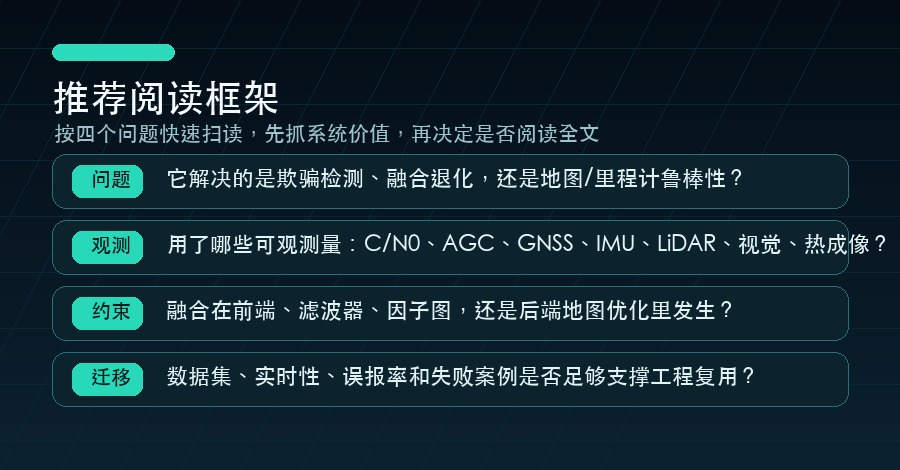

# 每日 GNSS 欺骗检测 / 多模态融合 / SLAM 论文推荐 | 2026-07-04

今天的推荐聚焦三个交叉点：GNSS 欺骗/干扰检测、多模态融合定位、SLAM 与鲁棒里程计。筛选逻辑优先考虑主题相关性、新近度、引用/venue/开源代码等质量信号，以及是否能给工程系统带来可验证的思路。

## 筛选方法论

这份日报不是简单按 arXiv 最新排序，而是先用主题查询收集候选论文，再做标题级去重，并按关键词命中、主题覆盖、发布时间、引用/venue/代码/数据集线索和工程迁移价值排序。阅读时建议重点看：问题定义是否清晰、观测量是否可靠、融合位置是否合理、实验是否覆盖失败案例。

## 今日速览

1. **EllipseLIO: Adaptive LiDAR Inertial Odometry with an Ellipsoid Representation**
   - 作者：Rowan Border, Margarita Chli
   - 日期：2026-05-20
   - 链接：http://arxiv.org/abs/2605.21150v1
   - 质量信号：质量分 3.0；引用 0；有代码线索
   - 推荐理由：主题贴合 自定义研究主题、多模态/多传感器融合、SLAM 与鲁棒里程计，关键词集中在 lidar inertial odometry、lio、lidar、inertial、odometry、robust。质量信号：引用 0、有代码线索，适合作为今日跟踪论文。
2. **Ultra-Fusion: A Resilient Tightly-Coupled Multi-Sensor Fusion SLAM Framework under Sensor Degradation and Spatiotemporal Perturbation for Intelligent Transportation Systems**
   - 作者：Yihong Tian, Junjie Zhang, Liuyang Li, Deteng Zhang 等
   - 日期：2026-06-19
   - 链接：http://arxiv.org/abs/2606.21223v1
   - 质量信号：质量分 5.5；有代码线索；数据集/benchmark
   - 推荐理由：主题贴合 自定义研究主题、多模态/多传感器融合、SLAM 与鲁棒里程计，关键词集中在 lio、fusion、multi-sensor、lidar、imu、gnss、slam、localization。质量信号：有代码线索、有数据集/benchmark 线索，适合作为今日跟踪论文。
3. **FUSE: A Framework for Unified State Estimation in Vehicular and Robotic SLAM Systems**
   - 作者：Wei Wu, Honglin Chen, Wenhan Cao, Yao Lyu 等
   - 日期：2026-05-18
   - 链接：http://arxiv.org/abs/2605.18047v3
   - 质量信号：质量分 0.0；暂无外部质量元数据
   - 推荐理由：主题贴合 自定义研究主题、多模态/多传感器融合、SLAM 与鲁棒里程计，关键词集中在 lio、lidar、inertial、imu、tightly coupled、slam、loop、degeneracy。质量信号以主题相关和新近度为主，适合作为今日跟踪论文。
4. **FAR-LIO: Enabling High-Speed Autonomy through Fast, Accurate, and Robust LiDAR-Inertial Odometry**
   - 作者：Maximilian Leitenstern, Marcel Weinmann, Patrick Haft, Tobias Lasser 等
   - 日期：2026-06-24
   - 链接：http://arxiv.org/abs/2606.26010v1
   - 质量信号：质量分 6.0；代码开源
   - 推荐理由：主题贴合 自定义研究主题、多模态/多传感器融合、SLAM 与鲁棒里程计，关键词集中在 lio、lidar、inertial、imu、kalman、odometry、loop、robust。质量信号：代码开源，适合作为今日跟踪论文。

## 重点推荐

### 1. EllipseLIO: Adaptive LiDAR Inertial Odometry with an Ellipsoid Representation

- **论文信息**：Rowan Border, Margarita Chli；2026-05-20；cs.RO
- **原文链接**：http://arxiv.org/abs/2605.21150v1
- **关键词**：lidar inertial odometry、lio、lidar、inertial、odometry、robust
- **质量信号**：质量分 3.0；引用 0；有代码线索
- **为什么值得读**：这篇论文同时覆盖 自定义研究主题、多模态/多传感器融合、SLAM 与鲁棒里程计，并在标题/摘要中出现 lidar inertial odometry、lio、lidar、inertial、odometry、robust 等信号；质量侧还有 质量分 3.0；引用 0；有代码线索。它适合用来观察该方向近期如何处理鲁棒性、异常检测或融合估计问题。
- **对 GNSS/融合/SLAM 系统的启发**：适合关注传感器时空同步、退化场景切换和外点剔除策略，这些通常决定系统能否从实验室走向实车/无人机部署。
- **摘要要点**：从题名与摘要看，论文主要关注 SLAM/里程计在复杂环境中的鲁棒状态估计；方法线索包括 lidar inertial odometry、lio、lidar、inertial、odometry、robust。阅读全文时建议重点看 前端几何建模、后端约束、回环或地图表达对鲁棒性的贡献，再判断是否适合迁移到自己的工程链路。

### 2. Ultra-Fusion: A Resilient Tightly-Coupled Multi-Sensor Fusion SLAM Framework under Sensor Degradation and Spatiotemporal Perturbation for Intelligent Transportation Systems

- **论文信息**：Yihong Tian, Junjie Zhang, Liuyang Li, Deteng Zhang 等；2026-06-19；cs.RO
- **原文链接**：http://arxiv.org/abs/2606.21223v1
- **关键词**：lio、fusion、multi-sensor、lidar、imu、gnss、slam、localization、vio、degeneracy
- **质量信号**：质量分 5.5；有代码线索；数据集/benchmark
- **为什么值得读**：这篇论文同时覆盖 自定义研究主题、多模态/多传感器融合、SLAM 与鲁棒里程计，并在标题/摘要中出现 lio、fusion、multi-sensor、lidar、imu、gnss、slam、localization、vio、degeneracy 等信号；质量侧还有 质量分 5.5；有代码线索；数据集/benchmark。它适合用来观察该方向近期如何处理鲁棒性、异常检测或融合估计问题。
- **对 GNSS/融合/SLAM 系统的启发**：适合关注传感器时空同步、退化场景切换和外点剔除策略，这些通常决定系统能否从实验室走向实车/无人机部署。
- **摘要要点**：从题名与摘要看，论文主要关注 多传感器融合定位中的一致性、同步和退化处理；方法线索包括 lio、fusion、multi-sensor、lidar、imu、gnss。阅读全文时建议重点看 融合框架、传感器缺失时的降级策略、外点剔除和实时性，再判断是否适合迁移到自己的工程链路。

### 3. FUSE: A Framework for Unified State Estimation in Vehicular and Robotic SLAM Systems

- **论文信息**：Wei Wu, Honglin Chen, Wenhan Cao, Yao Lyu 等；2026-05-18；cs.RO
- **原文链接**：http://arxiv.org/abs/2605.18047v3
- **关键词**：lio、lidar、inertial、imu、tightly coupled、slam、loop、degeneracy
- **质量信号**：质量分 0.0；暂无外部质量元数据
- **为什么值得读**：这篇论文同时覆盖 自定义研究主题、多模态/多传感器融合、SLAM 与鲁棒里程计，并在标题/摘要中出现 lio、lidar、inertial、imu、tightly coupled、slam、loop、degeneracy 等信号；质量侧还有 质量分 0.0；暂无外部质量元数据。它适合用来观察该方向近期如何处理鲁棒性、异常检测或融合估计问题。
- **对 GNSS/融合/SLAM 系统的启发**：适合关注传感器时空同步、退化场景切换和外点剔除策略，这些通常决定系统能否从实验室走向实车/无人机部署。
- **摘要要点**：从题名与摘要看，论文主要关注 SLAM/里程计在复杂环境中的鲁棒状态估计；方法线索包括 lio、lidar、inertial、imu、tightly coupled、slam。阅读全文时建议重点看 前端几何建模、后端约束、回环或地图表达对鲁棒性的贡献，再判断是否适合迁移到自己的工程链路。

### 4. FAR-LIO: Enabling High-Speed Autonomy through Fast, Accurate, and Robust LiDAR-Inertial Odometry

- **论文信息**：Maximilian Leitenstern, Marcel Weinmann, Patrick Haft, Tobias Lasser 等；2026-06-24；cs.RO
- **原文链接**：http://arxiv.org/abs/2606.26010v1
- **关键词**：lio、lidar、inertial、imu、kalman、odometry、loop、robust
- **质量信号**：质量分 6.0；代码开源
- **为什么值得读**：这篇论文同时覆盖 自定义研究主题、多模态/多传感器融合、SLAM 与鲁棒里程计，并在标题/摘要中出现 lio、lidar、inertial、imu、kalman、odometry、loop、robust 等信号；质量侧还有 质量分 6.0；代码开源。它适合用来观察该方向近期如何处理鲁棒性、异常检测或融合估计问题。
- **对 GNSS/融合/SLAM 系统的启发**：适合关注传感器时空同步、退化场景切换和外点剔除策略，这些通常决定系统能否从实验室走向实车/无人机部署。
- **摘要要点**：从题名与摘要看，论文主要关注 SLAM/里程计在复杂环境中的鲁棒状态估计；方法线索包括 lio、lidar、inertial、imu、kalman、odometry。阅读全文时建议重点看 前端几何建模、后端约束、回环或地图表达对鲁棒性的贡献，再判断是否适合迁移到自己的工程链路。

## 推荐阅读框架

## 今日观察

GNSS 相关论文正在从单点接收机检测走向跨传感器、跨平台和时空一致性验证；SLAM 方向则越来越强调在退化、动态和大尺度场景下的恢复能力。对自动驾驶、无人机和机器人系统来说，下一步值得重点关注的是：把 GNSS 完整性监测放进状态估计闭环，而不是只把它当成后处理告警。

## 明日检索关键词

`GNSS spoofing detection`、`PNT integrity`、`LiDAR-Inertial-Visual-GNSS`、`degeneracy-aware odometry`、`multimodal SLAM`、`factor graph fusion`。

> 本文基于公开论文元数据生成，建议阅读原文后再引用具体实验结论。
