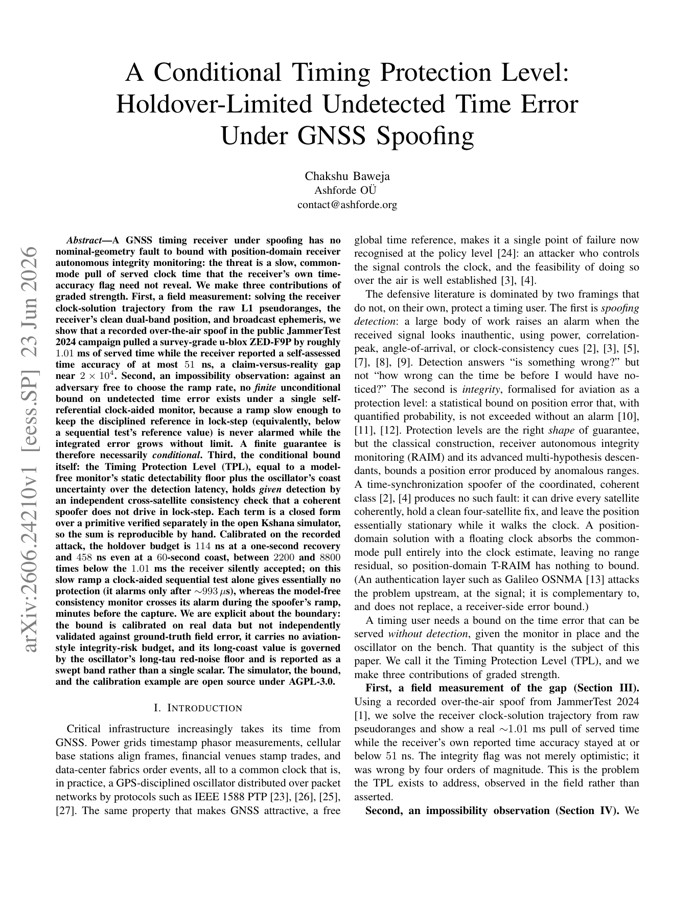
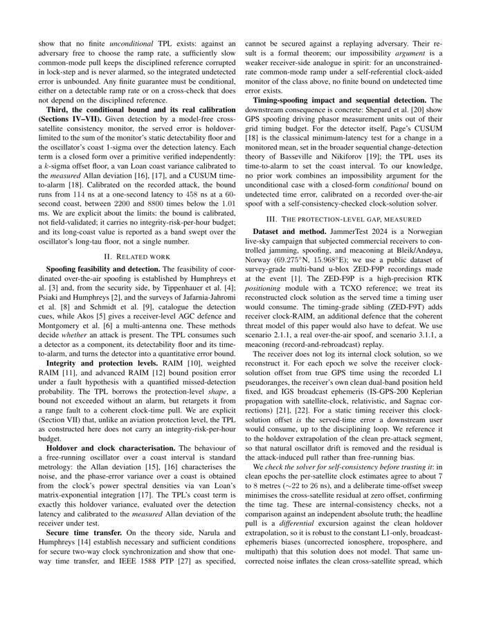

# 论文解读｜A Conditional Timing Protection Level: Holdover-Limited Undetected Time Error Under GNSS Spoofing

- 作者：波波机器人
- 论文作者：Chakshu Baweja
- 日期：2026-06-23
- 原文：http://arxiv.org/abs/2606.24210v1

## 一句话读懂

这篇论文围绕GNSS/PNT 接收机以及依赖它的车辆、机器人或授时系统遇到的“外部信号可能被伪造、压制或缓慢拉偏，系统却还会输出看似可信的位置或时间”展开，核心看点是方法主线是围绕接收机观测、攻击构造、检测统计量、保护级或轻量模型把输入、处理和输出连起来；线索落在 Calibrated，数字包括 114 ns, 458 ns, 1.01 ms, 1 ms。

## 读前抓手

- 先圈题目里的关键词：gnss timing, spoofing, protection level, GNSS, integrity, attack, detection, receiver。它们把文章带到开放环境里的定位、导航和授时链路，后文要追的是外部信号可能被伪造、压制或缓慢拉偏，系统却还会输出看似可信的位置或时间。
- 摘要给出的第一条线索是：GNSS/PNT 接收机以及依赖它的车辆、机器人或授时系统面对的核心风险是外部信号可能被伪造、压制或缓慢拉偏，系统却还会输出看似可信的位置或时间；线索落在 JammerTest, ZED-F9P, broadcast ephemeris，数字包括 1.01 ms, 51 ns, 000x。这决定了文章不是只看最终效果，而是在追踪问题怎样发生。
- 第二条线索落在做法：方法主线是围绕接收机观测、攻击构造、检测统计量、保护级或轻量模型把输入、处理和输出连起来；线索落在 Calibrated，数字包括 114 ns, 458 ns, 1.01 ms, 1 ms。读方法时优先找输入、假设、核心运算和输出。
- 图注里反复出现 spoofing，说明主图很可能承载了系统流程、实验设置或结果对比。
- 这篇有代码或复现线索，读完方法后可以直接检查代码是否覆盖数据预处理、训练/检测和评估脚本。

## 故事版导读

读《A Conditional Timing Protection Level: Holdover-Limited Undetected Time Error Under GNSS Spoofing》时，可以先把主角放在开放环境里的定位、导航和授时链路里：GNSS/PNT 接收机以及依赖它的车辆、机器人或授时系统面对的核心风险是外部信号可能被伪造、压制或缓慢拉偏，系统却还会输出看似可信的位置或时间；线索落在 JammerTest, ZED-F9P, broadcast ephemeris，数字包括 1.01 ms, 51 ns, 000x。作者接着把镜头推到做法上，重点是方法主线是围绕接收机观测、攻击构造、检测统计量、保护级或轻量模型把输入、处理和输出连起来；线索落在 Calibrated，数字包括 114 ns, 458 ns, 1.01 ms, 1 ms。到了实验部分，证据会落在实验主线是用真实设备、回放信号、公开攻击数据、误报漏报、时间误差或部署算力验证问题是否真的被触碰到；线索落在 integrity。最后再回到工程问题：结论要落到GNSS 可信度评估、融合定位降权、告警策略和完整性监测；线索落在 JammerTest, ZED-F9P, broadcast ephemeris，数字包括 1.01 ms, 51 ns, 000x。这样读下来，论文就不是一堆模块名，而是一条从风险、动作、证据到落地边界的线。

## 章节精读

### 1. 背景和问题：先看矛盾从哪来

这一节先给问题定边界：主角是GNSS/PNT 接收机以及依赖它的车辆、机器人或授时系统，压力来自外部信号可能被伪造、压制或缓慢拉偏，系统却还会输出看似可信的位置或时间。GNSS/PNT 接收机以及依赖它的车辆、机器人或授时系统面对的核心风险是外部信号可能被伪造、压制或缓慢拉偏，系统却还会输出看似可信的位置或时间；线索落在 JammerTest, ZED-F9P, broadcast ephemeris，数字包括 1.01 ms, 51 ns, 000x。读到这里要抓住两个变量：系统相信了什么输入，以及这个输入在什么条件下会失真。

- 场景压力：线索落在 GNSS, spoofing, timing, RAIM，说明论文把问题放在开放环境里的定位、导航和授时链路里看，定位结果会继续影响后续通信、控制或授时。
- 失效来源：线索落在 JammerTest, ZED-F9P, broadcast ephemeris，数字包括 1.01 ms, 51 ns, 000x，危险点在于输入被污染后，GNSS/PNT 接收机以及依赖它的车辆、机器人或授时系统仍可能给出像正常一样的输出。
- 作者抓住的变量：线索落在 Calibrated，数字包括 114 ns, 458 ns, 1.01 ms, 1 ms，这就是后文要反复跟踪的观测量、攻击参数或系统状态。
- 这对定位系统的影响：线索落在 integrity，影响会从单个观测扩散到GNSS 可信度评估、融合定位降权、告警策略和完整性监测。

### 2. 方法拆解：把做法拆成输入、核心动作和输出

方法部分可以拆成三步：先确认输入数据，再看作者怎样构造接收机观测、攻击构造、检测统计量、保护级或轻量模型，最后看输出如何服务于GNSS 可信度评估、融合定位降权、告警策略和完整性监测。方法主线是围绕接收机观测、攻击构造、检测统计量、保护级或轻量模型把输入、处理和输出连起来；线索落在 Calibrated，数字包括 114 ns, 458 ns, 1.01 ms, 1 ms。这一步要把每个模块和它消耗的观测量对上号。

- 输入/观测：线索落在 Calibrated，数字包括 114 ns, 458 ns, 1.01 ms, 1 ms，先确认这些输入是实测、回放、仿真，还是由模型生成。
- 核心步骤：线索落在 JammerTest, ZED-F9P, broadcast ephemeris，数字包括 1.01 ms, 51 ns, 000x，把这些步骤按时间顺序串起来，就是论文的主处理链。
- 模型或检测量：线索落在 timing, Timing Protection Level, TPL, cross-satellite consistency，读到这里要分清哪些是可测变量，哪些是作者构造出的判断量。
- 输出形式：线索落在 GNSS, spoofing, timing, RAIM，输出必须能被后续模块消费，才有机会接入GNSS 可信度评估、融合定位降权、告警策略和完整性监测。
- 接入方式：短句线索是 Second, an impossibility: against an adversary free to choose the ramp rate, no finite unconditional bound...，工程接入时要明确它改变告警、权重、地图还是控制决策。

### 3. 主图和关键图解：先沿着数据流走一遍

主图：论文 PDF 第 1 页截图

主图先用来建立文章地图：谁是输入，谁在中间处理，谁是输出。有了这条线，再读方法和实验就不会被模块名绕住。

论文图：论文 PDF 第 2 页截图

这张图放在后面看细节：它要么补充实验对比，要么解释某个模块的内部变量。读的时候把它和真实设备、回放信号、公开攻击数据、误报漏报、时间误差或部署算力对应起来。

### 4. 实验验证：看数据、场景和指标是否对得上问题

实验部分要回答“证据够不够”。这篇的证据应落在真实设备、回放信号、公开攻击数据、误报漏报、时间误差或部署算力。实验主线是用真实设备、回放信号、公开攻击数据、误报漏报、时间误差或部署算力验证问题是否真的被触碰到；线索落在 integrity。读表格和曲线时，把数据来源、对比对象、失败场景和指标单位放在一起看。

- 数据来源：线索落在 JammerTest, ZED-F9P, broadcast ephemeris，数字包括 1.01 ms, 51 ns, 000x，先看数据来自真实设备、公开数据集还是仿真环境。
- 实验场景：线索落在 GNSS, spoofing, timing, RAIM，场景越贴近开放环境里的定位、导航和授时链路，结论越值得迁移。
- 对比指标：线索落在 integrity，这里要看指标是否直接对应外部信号可能被伪造、压制或缓慢拉偏，系统却还会输出看似可信的位置或时间。
- 结果读法：短句线索是 Second, an impossibility: against an adversary free to choose the ramp rate, no finite unconditional bound...，重点不是单个数值好看，而是强弱场景和失败样本能否解释得通。
- 失败边界：线索落在 Calibrated，数字包括 114 ns, 458 ns, 1.01 ms, 1 ms，这些边界决定方法换平台后要重新标定什么。

### 5. 贡献边界和复现：把亮点翻成工程判断

收束部分要看作者把贡献限定在哪里。对工程读者来说，关键不是记住一个新名字，而是判断它能否接到GNSS 可信度评估、融合定位降权、告警策略和完整性监测。结论要落到GNSS 可信度评估、融合定位降权、告警策略和完整性监测；线索落在 JammerTest, ZED-F9P, broadcast ephemeris，数字包括 1.01 ms, 51 ns, 000x。

- 主要贡献：线索落在 JammerTest, ZED-F9P, broadcast ephemeris，数字包括 1.01 ms, 51 ns, 000x，贡献要回到GNSS 可信度评估、融合定位降权、告警策略和完整性监测才有工程价值。
- 适用条件：线索落在 GNSS, spoofing, timing, RAIM，这些条件决定论文结论能不能迁移到自己的传感器和场景。
- 工程收益：线索落在 IMU, open source, AGPL-3.0，真正的收益是减少误信、漂移、漏检或计算开销。
- 需要复核的边界：短句线索是 Second, an impossibility: against an adversary free to choose the ramp rate, no finite unconditional bound...，复现时要优先检查数据、参数、同步和评价脚本。

## 读完之后可以追问

- 如果把 gnss timing 换到自己的机器人或车辆平台，最先需要重新标定的是输入数据、阈值，还是传感器外参？
- 论文里的证据是否覆盖了开放环境里的定位、导航和授时链路里最容易失败的场景，还是只证明了一个受控设置？
- 这套做法接入GNSS 可信度评估、融合定位降权、告警策略和完整性监测时，应该输出连续可信度、离散告警，还是直接改变优化权重？

> 图像来自论文 PDF，仅用于论文解读和学术讨论，正式转载前建议核对论文许可和作者要求。
